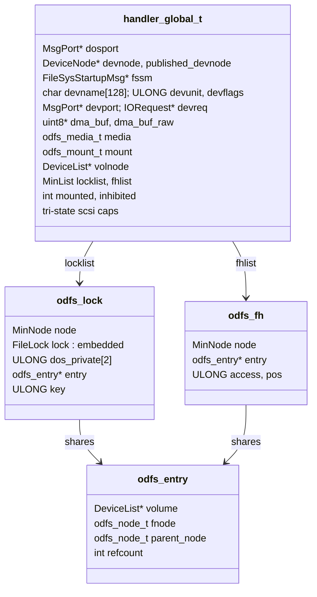
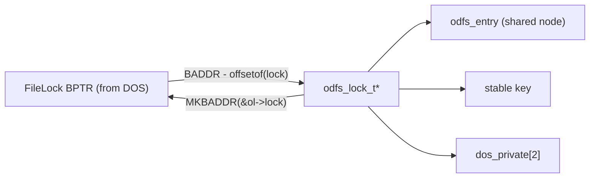
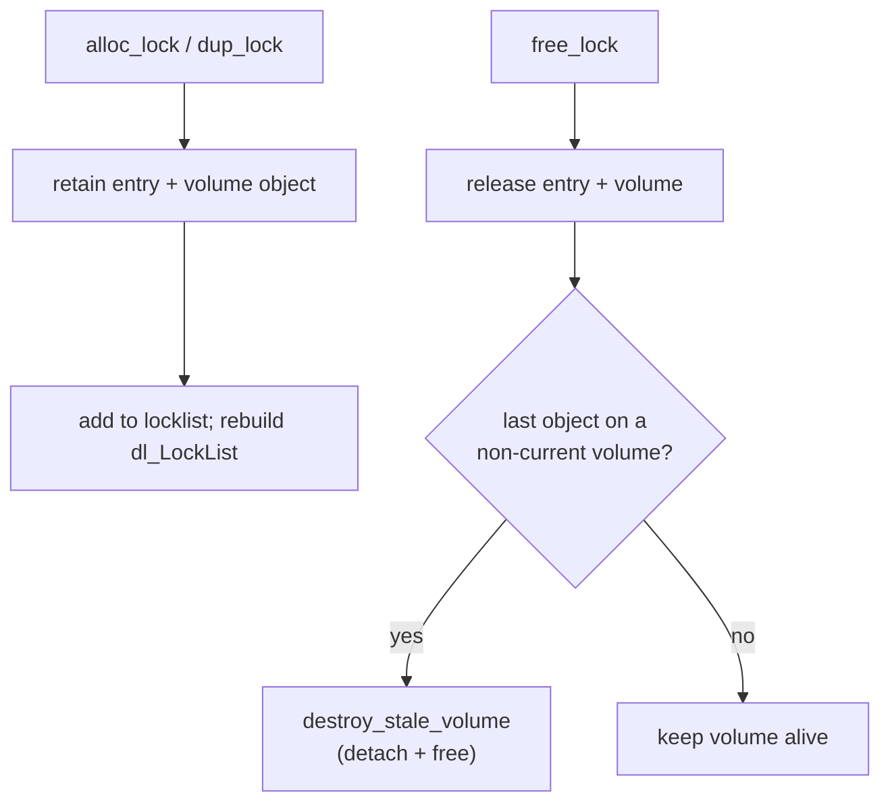
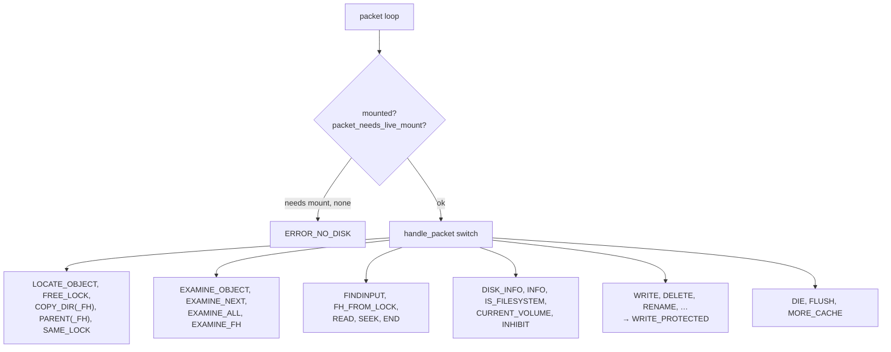
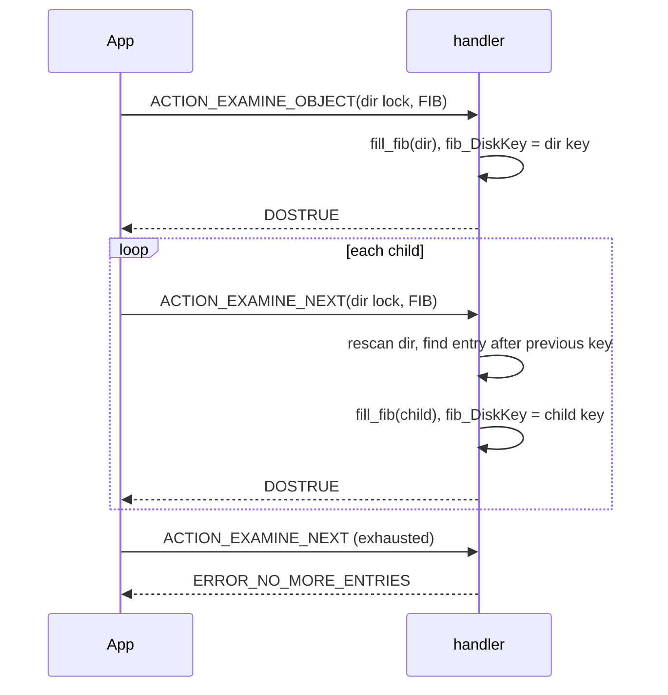
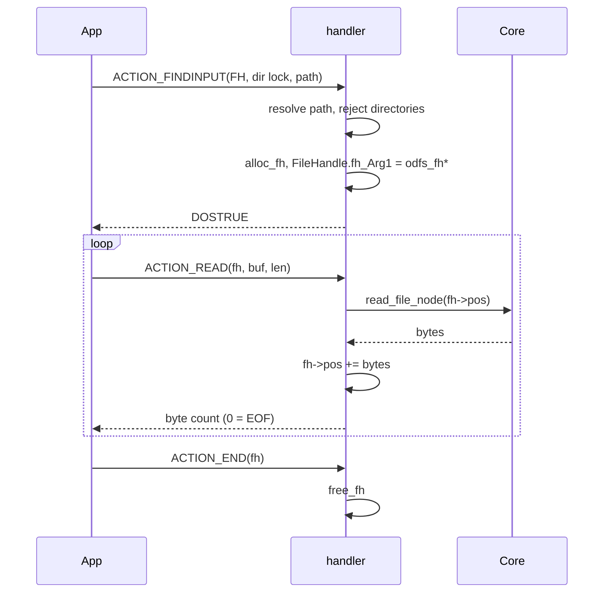
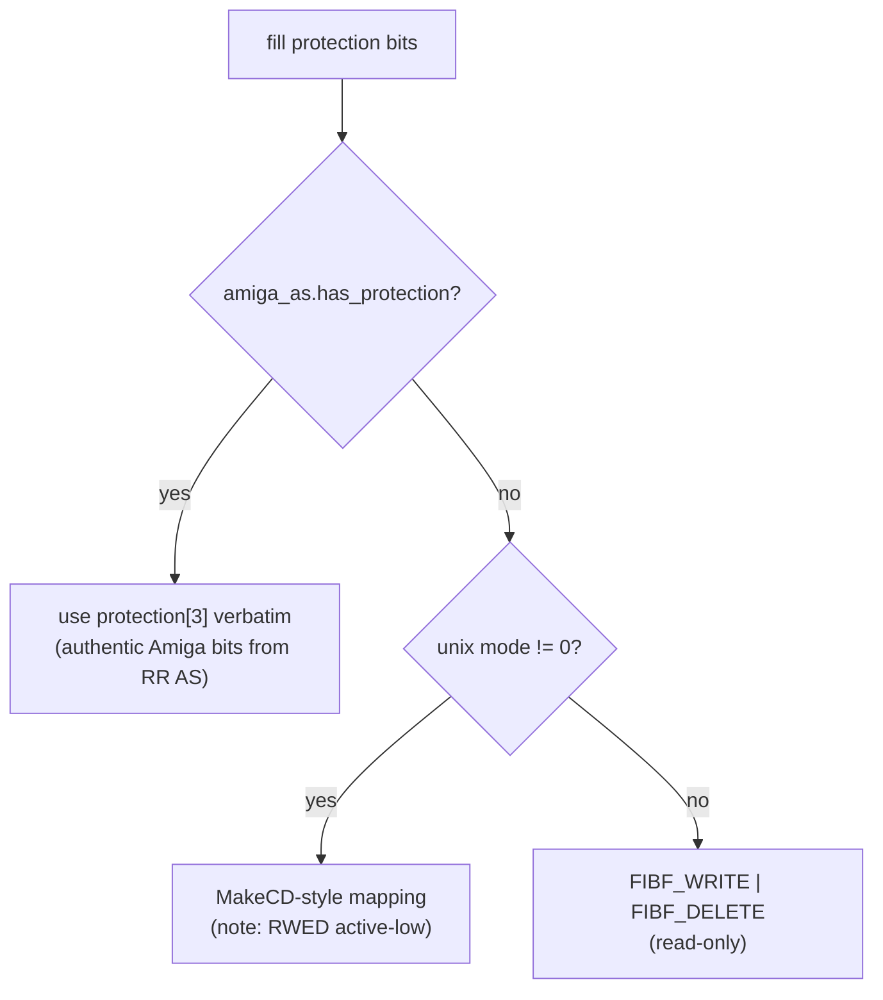
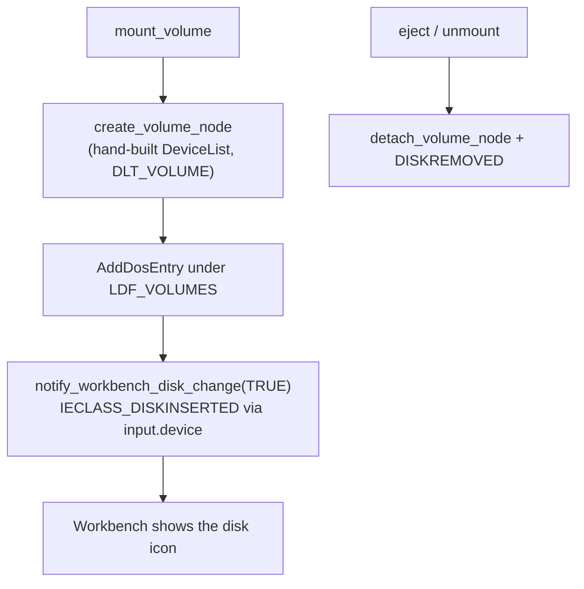
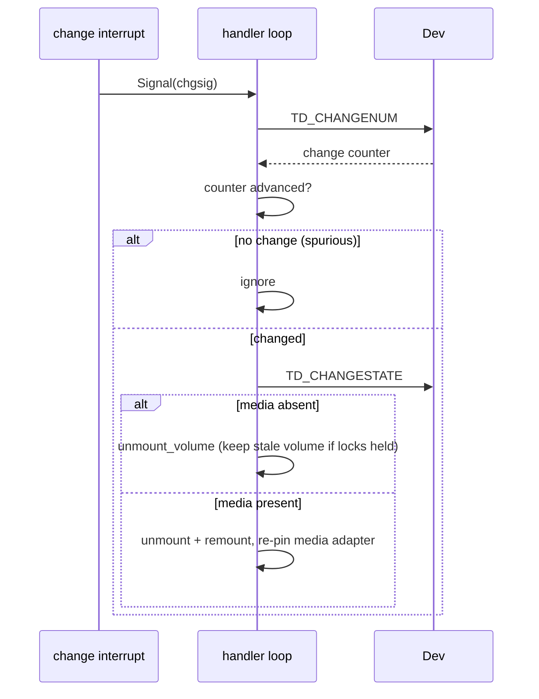

# The AmigaDOS Handler Frontend

`platform/amiga/handler_main.c` is the largest single file in the project (~3,700
lines) and the only part that is Amiga-specific. It is a classic AmigaDOS
**DosPacket handler**: it mounts as `L:ODFileSystem`, runs as its own Process, and
speaks the packet protocol that `dos.library` and Workbench use to ask a filesystem
to do things. Everything below it — parsing, caching, charset — is the portable
engine it drives through `include/odfs/api.h`.

This document covers the handler's lifecycle, the lock and file-handle model, every
packet it answers, how it translates the node model into AmigaDOS structures, and
the hardware realities (DMA, SCSI, media change) it must manage. For a
cross-layer trace of a single request, see [data-flows.md](data-flows.md).

## Process model & global state

The handler is **strictly single-threaded**: one Process, one DOS message port, one
device I/O request, packets processed serially. All mutable state lives in a single
per-process block, `handler_global_t *g`, allocated at startup
(`handler_main.c:3474`). The only other globals are the three library bases
(`SysBase`, `DOSBase`, `UtilityBase`). This is what makes multiple independent
mounts (`CD0:`, `CD1:`) possible — each is a separate Process with its own `g`.



## Lifecycle

```mermaid
sequenceDiagram
    participant DOS
    participant H as handler_main
    participant Dev as exec device
    participant Core as odfs core

    DOS->>H: start Process, send startup DosPacket
    H->>H: AllocMem(g); init lock/fh lists
    H->>H: WaitPort/GetMsg startup packet
    H->>H: parse DeviceNode (Arg3), FSSM (Arg2)
    H->>H: devname/unit/flags, sector_size = SizeBlock<<2
    H->>H: OpenLibrary(dos,utility)
    H->>Dev: CreateIORequest, OpenDevice(devname, unit)
    H->>Dev: TEST UNIT READY, MODE SELECT 2048 (non-fatal)
    H->>H: alloc 16-byte-aligned DMA bounce buffer
    H->>H: wire amiga_media_ops into g->media
    H-->>DOS: REPLY startup packet (DOSTRUE) ← before mount!
    H->>H: publish_device_node, mount_volume, install media-change
    loop main packet loop (Wait dossig | chgsig)
        DOS->>H: DosPacket
        H->>Core: handle_packet → odfs_* calls
        H-->>DOS: return_packet (Res1/Res2)
    end
    DOS->>H: ACTION_DIE
    H->>H: unmount, drain locks/fhs, unpublish, free g
```

### Startup packet decoding

The startup `DosPacket` carries the mount configuration. `dp_Arg3` is the
`DeviceNode` BPTR; `dp_Arg2` is the `FileSysStartupMsg`, which yields the exec
device name (a BSTR), unit, flags, and the `DosEnvec` environment
(`handler_main.c:3502`). The sector size is derived from the Mountlist as
`de_SizeBlock << 2` (longwords → bytes), so `SectorSize=2048` in the `CD0`
Mountlist means `de_SizeBlock=512`.

### The reply-before-mount ordering

A non-obvious but load-bearing detail: the handler **replies to the startup packet
before** it publishes the volume node or mounts (`handler_main.c:3633`). DOS holds
the device-list lock while waiting for the startup reply; publishing and mounting
need to take that same lock, so doing them before replying would deadlock. Reply
first, then publish and mount.

### Device and media prep

After opening the exec device, the handler issues best-effort SCSI commands —
`TEST UNIT READY` and `MODE SELECT(6)` to force 2048-byte blocks — both non-fatal,
because IDE/trackdisk paths reject SCSI passthrough and that's expected. It then
allocates the DMA bounce buffer from `de_BufMemType` (often `MEMF_CHIP`), 16-byte
aligned for 68040 DMA (`handler_main.c:3596`). All sector reads pass through this
buffer; see [media-layer.md](media-layer.md#amiga-implementation).

## The lock model

This is the heart of the AmigaDOS integration and where the recent commits
("reserve DOS private words after FileLock", "publish a device node with startup
metadata", "allow DupLockFromFH on regular files") have focused. Three structures
cooperate:

- **`struct odfs_lock`** wraps an *embedded* `struct FileLock` at a known offset,
  preceded by a `MinNode` (for the lock list) and followed by `dos_private[2]` plus
  pointers to the shared entry and a stable key (`handler.h:116`).
- **`struct odfs_entry`** is the shared object: the `odfs_node_t`, its parent node,
  the volume, and a refcount. Locks *and* file handles point at entries, so
  `DupLock` and `FH-from-lock` share identity cheaply (`handler.h:107`).
- **`struct odfs_fh`** is a file handle: an entry plus an access mode and a byte
  position (`handler.h:134`).

### BPTR ↔ wrapper conversion

DOS only ever sees a BPTR to the embedded `FileLock`. The wrapper is recovered by
pointer arithmetic:



`LOCK_FROM_BPTR`/`LOCK_TO_BPTR` (`handler.h:144`).

### Why `dos_private[2]` exists

Some AmigaDOS versions scribble 8 bytes immediately *after* a `FileLock`. The
wrapper reserves exactly those 8 bytes as `dos_private[2]`, enforced by two
compile-time assertions that the field sits right after the embedded `FileLock` and
is exactly 8 bytes (`handler.h:124`). Without this padding, DOS would corrupt the
adjacent `entry`/`key` fields. `dos_private[1]` is additionally reused as the
`Examine` iteration sentinel (set to `-1` by `ACTION_EXAMINE_OBJECT`) — safe because
the handler is single-threaded.

### Stable keys

`fl_Key` and `fib_DiskKey` must be stable across directory rescans, but the node
`id` is *not* (backends regenerate it each walk). So `amiga_node_key`
(`handler_main.c:1139`) derives the key from on-disc identity: top 3 bits = backend,
low 28 bits = `extent.lba`, with fallbacks to keep it non-zero. This stable key is
what makes the `Examine`/`ExNext` resume model and Workbench identity work.

### Refcounting and stale volumes



When a disc is ejected with locks still held, the volume becomes *stale* but is kept
alive until its last lock/handle closes — classic AmigaDOS removable-media
semantics ("close your old locks before the new disc is usable"). Any packet
touching a stale lock is rejected by `validate_object_volume` with
`ERROR_DEVICE_NOT_MOUNTED` (`handler_main.c:1118`).

## Packet dispatch

`handle_packet` (`handler_main.c:2656`) is one big `switch`. Every handler sets
`dp_Res1 = DOSFALSE, dp_Res2 = 0` then overwrites: `dp_Res1` carries the result
(BPTR / byte count / boolean), `dp_Res2` the DOS error on failure.



### Namespace & lock packets

| Packet | What it does | Core call |
| --- | --- | --- |
| `ACTION_LOCATE_OBJECT` | `Lock(path)` → new lock | `resolve_amiga_path` |
| `ACTION_FREE_LOCK` | release a lock | `free_lock` |
| `ACTION_COPY_DIR` | `DupLock` (shares entry) | `dup_lock` |
| `ACTION_COPY_DIR_FH` | `DupLockFromFH` — works on files too | `dup_lock` from FH node |
| `ACTION_PARENT` | parent of a lock | `odfs_resolve_parent_node` |
| `ACTION_PARENT_FH` | parent of a file handle | `odfs_resolve_parent_node` |
| `ACTION_SAME_LOCK` | compare two locks | `nodes_same` |

`ACTION_LOCATE_OBJECT` (`handler_main.c:1604`) is the workhorse: it converts the
BSTR path, resolves it from the parent lock (or root) via `resolve_amiga_path`, and
returns a fresh lock. `ACTION_PARENT` reconstructs the grandparent using the
ancestry search, short-circuiting when the parent is the mount root or a CDDA
virtual root.

### Examine & directory iteration

The AmigaDOS directory-iteration model is the classic "`Examine` then repeated
`ExNext`": `Examine` fills a `FileInfoBlock` for the directory itself and seeds
`fib_DiskKey`; each `ExNext` returns the *next* child.



`exnext_cb` (`handler_main.c:1954`) rescans the directory each call and stops at the
entry following the previously returned key. This is **O(n²)** for a full listing —
a deliberate trade that keeps `fib_DiskKey` an opaque, stable on-disc key rather
than leaking a private iterator offset to `icon.library`. At the mount root, when a
data filesystem's entries are exhausted, the synthetic `CDDA` directory is injected
as a final entry (`handler_main.c:2083`). `ACTION_EXAMINE_ALL` (ExAll,
`handler_main.c:2236`) is the batched variant with `eac_MatchString` pattern
matching and hook support.

### File handles & I/O



`fh_Arg1` holds a raw `odfs_fh*` (not a BPTR). `ACTION_READ`
(`handler_main.c:2460`) dispatches to CDDA or `odfs_read` by node backend and
advances the byte cursor. `ACTION_SEEK` bounds-checks against the node size and
returns the old position. `ACTION_FH_FROM_LOCK` turns a lock into a handle and
consumes the lock. Write-side opens (`FINDOUTPUT`, `FINDUPDATE`) are rejected as
writes.

### Info & control packets

`ACTION_DISK_INFO`/`ACTION_INFO` fill an `InfoData` reporting
`ID_WRITE_PROTECTED`, the volume's block count, and the volume node
(`handler_main.c:2554`). `ACTION_IS_FILESYSTEM` returns DOSTRUE (this is a real
filesystem, enabling `Lock`/`Examine` semantics). `ACTION_INHIBIT` unmounts on
non-zero and remounts on zero (used by tools that need exclusive access).

### Write rejection

Every mutating packet — `WRITE`, `DELETE_OBJECT`, `RENAME_OBJECT`, `CREATE_DIR`,
`SET_PROTECT`, `SET_COMMENT`, `SET_DATE`, … — routes to `action_write_protected` →
`ERROR_DISK_WRITE_PROTECTED` (`handler_main.c:2696`). Read-only is enforced at the
packet boundary, once.

## Translating the node model to AmigaDOS

### FileInfoBlock fill

`fill_fib` (`handler_main.c:1467`) is written once and works for every backend. It
fills the BCPL filename, the entry type (`ST_USERDIR`/`ST_FILE`, or `ST_ROOT` for
the volume root), size, block count, the stable `fib_DiskKey`, the date, the
protection bits, and the comment.

### Protection and comment



Three-tier precedence (`handler_main.c:1488`): a Rock Ridge Amiga `AS` field wins
and is used verbatim (preserving authentic burned-on Amiga protection bits); else
Unix mode bits from Rock Ridge POSIX perms are mapped (remembering AmigaDOS RWED
bits are *active-low* — set means denied); else a read-only fallback. The comment
comes from `amiga_as.comment` (`handler_main.c:1563`). This is the payoff of the
Rock Ridge `AS` parsing described in
[backends-iso-family.md](backends-iso-family.md#the-amiga-as-extension).

### Dates

Two converters share the Amiga 1978 epoch math: a validating one for the volume date
(`odfs_timestamp_to_datestamp`, `handler_main.c:117`) and an inline one in
`fill_fib`. `fill_volume_date` (`handler_main.c:150`) prefers root ctime, then
mtime, else the current time — so even a synthetic pure-audio CDDA volume gets a
unique `dl_VolumeDate`, which matters because Workbench keys volumes by name + date.

### BSTR / BCPL strings

Inbound paths and the device/control strings are BCPL length-prefixed BSTRs,
converted with `bstr_to_cstr` (`handler.h:153`). Outbound `fib_FileName`,
`fib_Comment`, and volume/device names are BCPL strings (length byte + data) capped
to their field sizes. Names are already UTF-8 from the core; no transcoding happens
at this boundary, and case-insensitive comparison uses `odfs_strcasecmp` /
`MatchPatternNoCase`.

## Volume node & Workbench integration



The volume node is a `struct DeviceList` built by hand rather than via
`MakeDosEntry`, specifically to preserve volume names containing metacharacters like
parentheses (`Audio CD (12345678)`). After adding it to the DOS list, the handler
sends an `IECLASS_DISKINSERTED` input event so Workbench pops up the icon
(`handler_main.c:2944`, `:3272`). The per-volume `dl_LockList` chain is rebuilt
under `Forbid()` whenever locks change, so `Info` and validation see a consistent
chain and the volume shows as "in use" while locks are held.

### Published device node

`publish_device_node` (`handler_main.c:2852`) ensures a `DeviceNode` exists on the
DOS device list with `dn_Startup = MKBADDR(fssm)` — re-publishing the
FileSysStartupMsg so tools (`Info`, mount queries) can read the device/unit/
environment. It adopts the original node if present, an existing same-named node if
found, or creates a shadow node it owns. This is the "publish a device node with
startup metadata" commit.

## Media change



The change interrupt only `Signal()`s the task; all work happens in the main loop
(`handle_media_change`, `handler_main.c:3423`). Crucially the handler **ignores the
interrupt unless `TD_CHANGENUM` actually advanced** — change interrupts fire
spuriously right after `TD_ADDCHANGEINT`, and a needless remount would invalidate
every outstanding lock. After a remount the cache is recreated, so the media adapter
context is re-pinned (`handler_main.c:3656`).

## Error mapping

`odfs_err_to_dos` (`handler.h:172`) translates core errors into AmigaDOS codes.
Highlights: `NOT_FOUND → ERROR_OBJECT_NOT_FOUND`, `BAD_FORMAT/CORRUPT →
ERROR_NOT_A_DOS_DISK`, `NOT_DIR/IS_DIR → ERROR_OBJECT_WRONG_TYPE`, `NO_MEDIA →
ERROR_NO_DISK`, and importantly **`EOF → 0`** so end-of-file is a short read rather
than an error.

## Freestanding runtime

The handler is built `-nostartfiles -noixemul -nostdlib` with a hand-written
`startup.S` entry — it is freestanding and must not drag in libc's stdio or
process-startup machinery. Two small files fill the gaps:

- **`printf_local.c`** — `odfs_snprintf`/`odfs_vsnprintf`, a compact bounded
  formatter the core's logging relies on. It includes a software `udiv64_32`
  (`printf_local.c:38`) because the 68000 target has no 64-bit divide and the build
  avoids pulling in libgcc's `__udivdi3` for size.
- **`libc_stubs.c`** — only `_exit`/`exit` and `__errno`. `_exit` deliberately
  *hangs* (`for(;;) Wait(0)`, `libc_stubs.c:22`) rather than returning, because a
  handler Process must never exit the C way — doing so would corrupt the system.

## ROM vs full handler

The ROM profile (`-DODFS_PROFILE_ROM`) compiles out the `Control=` string parser
(`handler_main.c:3005`, dropping the `dos/rdargs.h` dependency), the CDDA backend
and its `CDDA/` graft, and all serial-debug trace points. The packet logic, lock
model, and read path are otherwise identical. See [rom-profile.md](rom-profile.md)
and [build-system.md](build-system.md).

## Subtleties worth remembering

- **Reply-before-mount** avoids the device-list-lock deadlock.
- **Single shared `g->devreq`** serialises all device I/O (sector reads, TOC, media
  change) — consistent with the single-threaded loop, but any blocking `DoIO` stalls
  the whole handler.
- **`amiga_sector_count` returns 0** — never assume a fixed CD size.
- **`dos_private[1]` is dual-purpose** (DOS scratch + Examine sentinel), safe only
  because of single-threading.
- **Stable keys, transient ids** — never key DOS structures off `odfs_node_t.id`.
