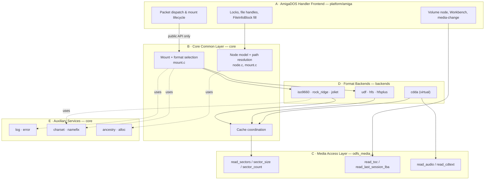
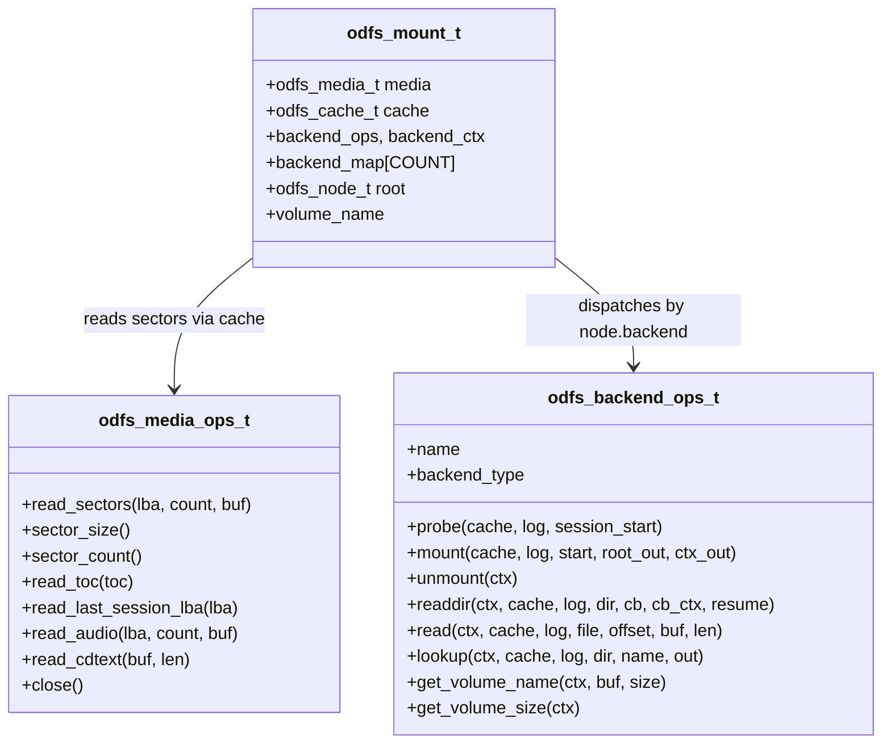
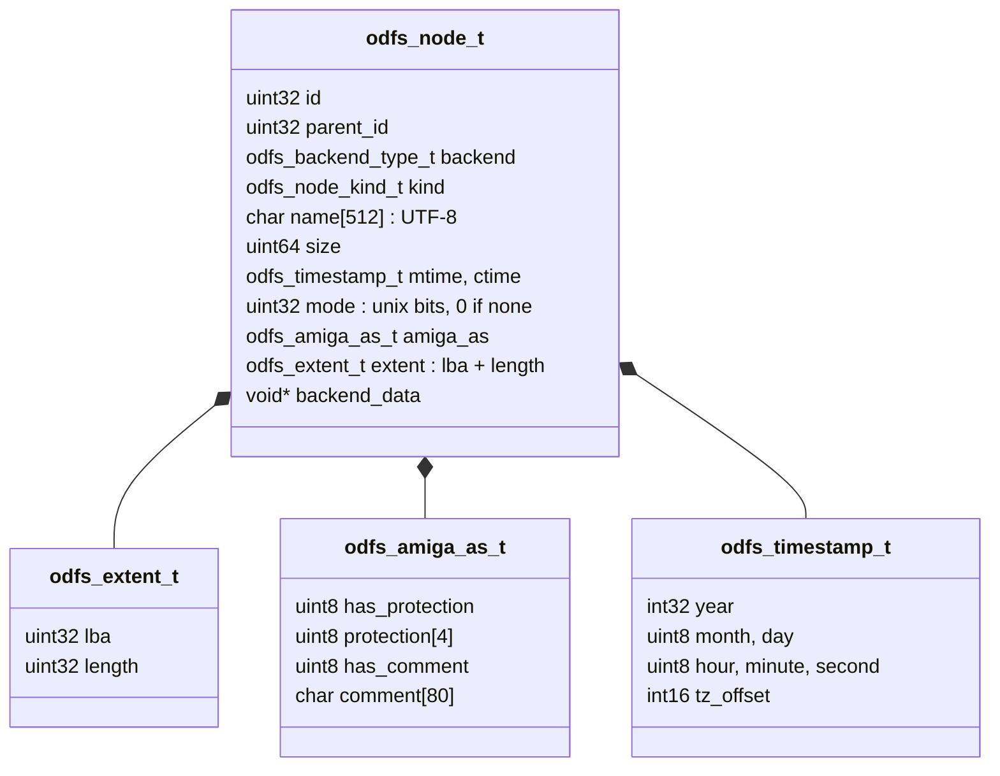
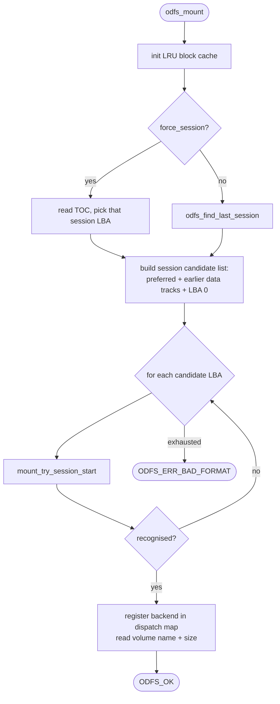
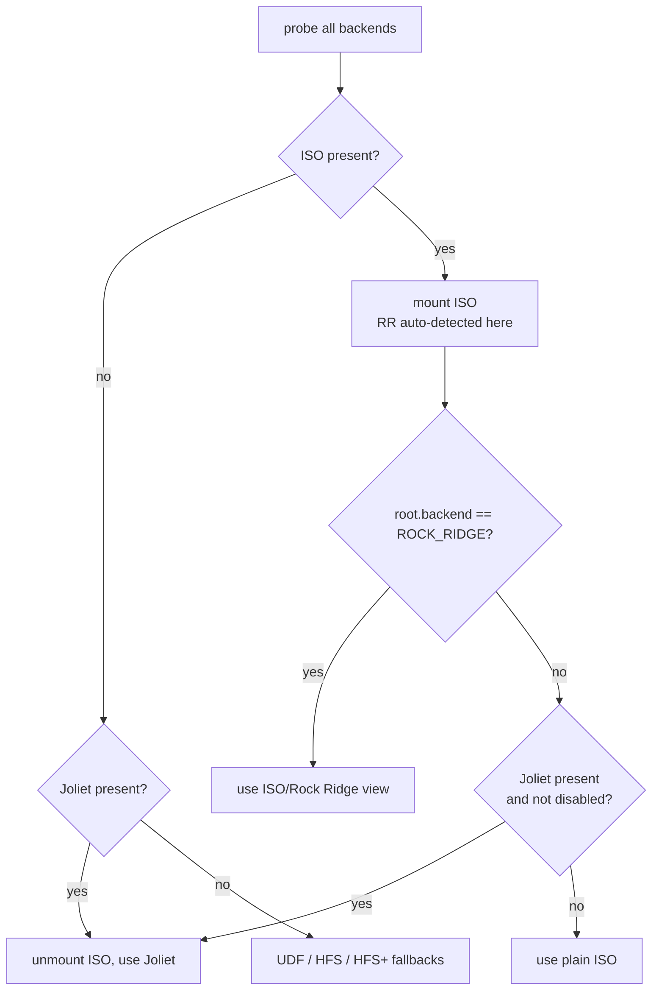
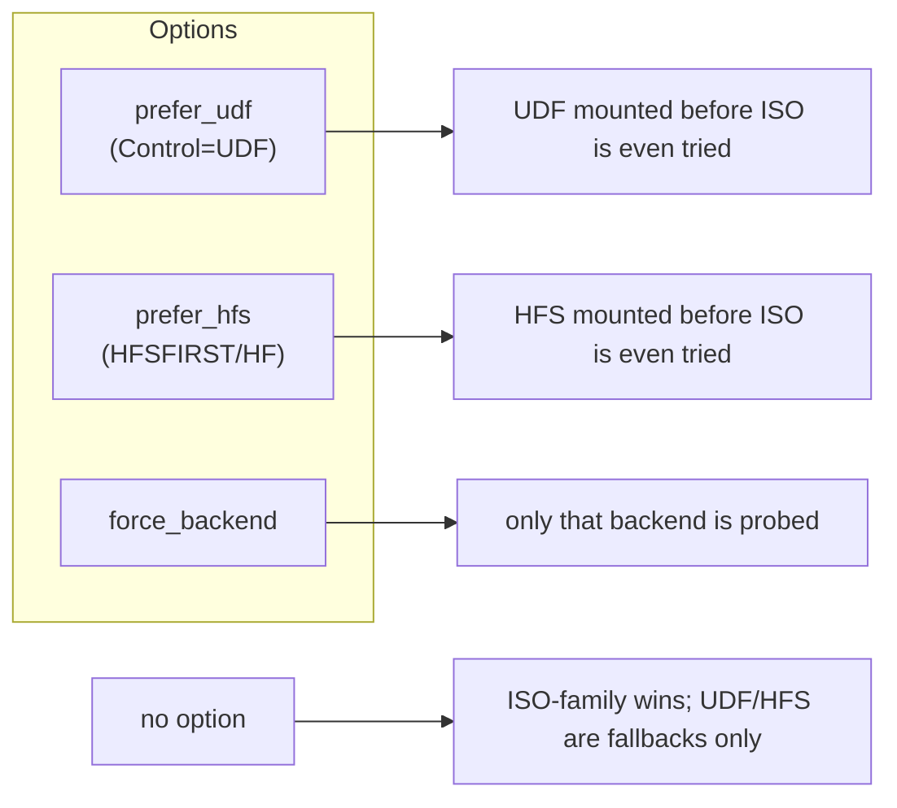
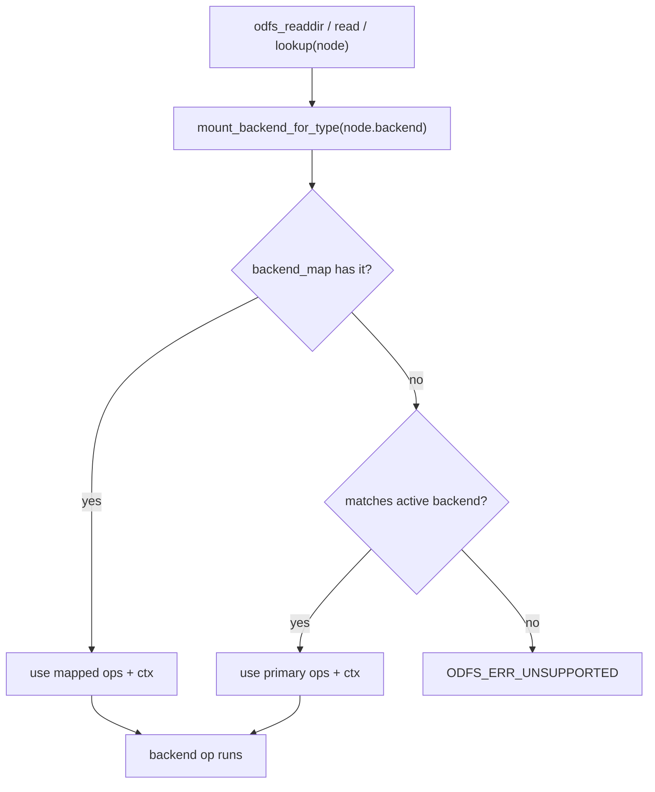

# Architecture

This document is the structural map of ODFileSystem: the five layers, the two
vtables that hold them apart, the object model that flows between them, and the
format-selection policy that decides what a hybrid disc looks like. For the
narrative big picture read [overview.md](overview.md) first; for a request traced
end-to-end read [data-flows.md](data-flows.md).

## The layered model

ODFS is a layered system where every layer talks to the next *only* through a
narrow, explicit interface. The payoff is testability: cut at any vtable and you
can drive the layer above with a mock and the layer below with a fake.



### A. AmigaDOS handler frontend (`platform/amiga/`)

Packet dispatch, mount lifecycle, lock and file-handle management, translation
from the internal node model to AmigaDOS structures (`FileLock`,
`FileInfoBlock`, `InfoData`, `DeviceList`). It is kept as policy-light as
practical: format precedence, charset, and parsing all live below it. Its real
weight is the *AmigaDOS protocol* — the lock model, the `Examine`/`ExNext`
iteration contract, removable-media semantics, and the DMA-safe read path. Fully
documented in [amiga-handler.md](amiga-handler.md).

### B. Core common layer (`core/`)

The portable heart. Owns:

- the mount engine and **format-selection policy** (`mount.c`),
- the internal **node model** (`odfs_node_t`),
- **path resolution** (`odfs_resolve_path`, `odfs_lookup`),
- **cache coordination**, and
- the **per-backend dispatch map** that lets one volume route different subtrees
  to different backends (the mixed-mode `CDDA/` graft).

Detailed in [core-layer.md](core-layer.md).

### C. Device / media access layer (`odfs_media_t`)

Sector reads through a vtable, media geometry, and session/TOC discovery. This is
the line that separates "a real drive behind `scsi.device`" from "an image file
on a host". It also carries the *optical-only* operations — raw audio frame reads
and CD-Text — that only a real drive can satisfy. Detailed in
[media-layer.md](media-layer.md).

### D. Format backends (`backends/`)

Pluggable readers, each implementing `odfs_backend_ops_t`. They turn on-disc bytes
into `odfs_node_t` values and nothing else. The frontend never needs to know which
backend produced a node — that is the whole point of the node model. Three
documents cover them:
[ISO family](backends-iso-family.md),
[UDF/HFS/HFS+](backends-udf-hfsplus.md),
[CDDA](backend-cdda.md).

For HFS-family media the frontend contract is **data-fork-only**: resource forks
and Finder metadata are intentionally not surfaced through the AmigaDOS view.

### E. Auxiliary services (`core/`)

Small, standalone, separately testable: structured logging (`log.c`), error→string
mapping (`error.c`), charset conversion (`charset.c`), deterministic name dedup
(`namefix.c`), parent/ancestor search (`ancestry.c`), and the allocator seam
(`alloc.h`). Detailed in [core-layer.md](core-layer.md#auxiliary-services).

## The two vtables that hold it together

Almost all of the architecture's flexibility comes from two function-pointer
tables. Understand these and you understand the system.



- **`odfs_media_ops_t`** (`include/odfs/media.h:32`) — the *downward* seam. A NULL
  optional op (e.g. `read_audio` on a host image) is converted to
  `ODFS_ERR_UNSUPPORTED` by the inline wrappers, so callers degrade gracefully.
- **`odfs_backend_ops_t`** (`include/odfs/backend.h:22`) — the *sideways* seam. The
  core holds a precedence-ordered table of these (`core/mount.c:36`) for selection,
  and a per-node-backend map (`backend_map[]`) for dispatch after mount.

Note that `probe`/`mount` receive a `cache`, **not** a `media` — backends read
through the cache and never touch the device directly. The one consequence worth
knowing: a backend cannot itself read the TOC (the cache has no TOC op), which is
why the **CDDA backend is driven from the handler** via a side entry point rather
than the standard probe path. See [backend-cdda.md](backend-cdda.md).

## The internal object model



Three properties of this model drive everything else:

1. **Self-describing and copyable.** A node carries its own on-disc location
   (`extent`). Backends recompute state from it on each call, so nodes can be
   stored in locks and file handles that outlive the directory scan that created
   them. Most backends never use `backend_data` at all and instead *overload*
   `extent.lba` to carry a backend-specific cursor (UDF: the ICB's physical LBA;
   HFS dir: the catalog node id (CNID); HFS file: the first allocation block).

2. **Identity is content, not pointer.** `odfs_node_matches_identity()`
   (`include/odfs/node.h:86`) compares `backend`, `kind`, `size`, `extent`, and
   `name`. It deliberately ignores `id`/`parent_id`, because those are *transient*
   — backends regenerate them on each directory walk. The Amiga handler likewise
   derives a *stable* lock key from `(backend, extent.lba)`, not from `id`
   (`handler_main.c:1139`). If you ever rely on `id` for persistence, you have a
   bug.

3. **One model, all formats.** ISO directory records, UDF File Entries, HFS
   catalog records, and synthetic CDDA tracks all collapse into this struct. The
   handler's `FileInfoBlock` fill code (`handler_main.c:1467`) is written once and
   works for every backend.

`odfs_node_kind_t` is `{FILE, DIR, SYMLINK, VIRTUAL}` (`include/odfs/node.h:28`);
`VIRTUAL` is how CDDA tracks and the synthetic `CDDB.txt`/`CD-TEXT.txt` files are
represented.

## Mount-time control flow



The candidate loop (`core/mount.c:382`) is the multisession safety net: the
preferred (last) session is tried first, then earlier data tracks from the TOC,
then LBA 0. The block cache is keyed by absolute LBA, so retrying a different
session is naturally cache-correct. The per-candidate selection inside
`mount_try_session_start` is where the precedence policy lives — covered next.

## Format selection

This is the most user-visible policy in the system. The mount engine probes a
fixed, precedence-ordered table and then *resolves* the winners according to the
hybrid/bridge rules and the user's mount options.

### The probe order

```c
backend_table = { iso9660, joliet, udf, hfs, hfsplus, NULL }   // core/mount.c:36
```

ISO 9660 is probed **first** because Rock Ridge is detected *inside* the ISO mount
(by inspecting the `.` entry's System Use Area), not by a separate backend. A
successful ISO mount therefore already knows whether the disc is Rock Ridge.

### ISO-family hybrids: RR > Joliet > plain ISO



A plain ISO disc with Rock Ridge wins immediately (`core/mount.c:170`). Without
Rock Ridge, Joliet's Unicode names are preferred over plain 8.3 ISO names — unless
`disable_joliet` (the `NOJOLIET`/`NOJ` mount flag) is set, in which case plain ISO
is used. This is why a Windows-mastered disc shows long filenames by default.

### Bridge discs (ISO + UDF) and hybrids (ISO + HFS)

The default is **prefer the ISO-family view**. The reasoning (from the README and
encoded in `core/mount.c`):

- Rock Ridge and Joliet map more naturally to the metadata path the handler
  already exposes.
- Bridge discs historically *expected* older systems to use the ISO side.
- Plain ISO-family trees are the least surprising fallback.
- UDF support is newer and more likely to hit edge cases on odd media.

So the user opts *into* UDF or HFS explicitly:



Concretely, in `mount_try_session_start`: if `prefer_udf` and UDF probed, UDF is
mounted *before* the ISO branch (`core/mount.c:153`); same for `prefer_hfs`
(`:159`). Otherwise ISO-family is resolved first and UDF/HFS/HFS+ are tried only
if nothing ISO-shaped mounted (`:187`–`:206`).

### Mount options that affect selection

| Option (`odfs_mount_opts_t`) | Control flag | Effect |
| --- | --- | --- |
| `force_backend` | — | Probe only that backend |
| `force_session` | — | Mount a specific session number |
| `disable_rr` | `NOROCKRIDGE` / `NORR` | Ignore Rock Ridge, fall to Joliet/ISO |
| `disable_joliet` | `NOJOLIET` / `NOJ` | Ignore Joliet, fall to plain ISO |
| `prefer_udf` | `UDF` | Prefer UDF on bridge discs |
| `prefer_hfs` | `HFSFIRST` / `HF` | Prefer HFS on hybrid discs |
| `lowercase_iso` | `LOWERCASE` | Lowercase plain ISO names |
| `prefer_aiff` | `AIFF` | Expose CDDA tracks as AIFF not WAV |
| `cache_blocks` | `FILEBUFFERS` / `FB` | Block-cache capacity |

Defaults are set in `odfs_mount_opts_default` (`core/mount.c:290`): auto backend,
last session, nothing disabled, preserve case, WAV audio, default cache size. The
Amiga handler parses the `Control=` string into these options
(`handler_main.c:3005`); see [amiga-handler.md](amiga-handler.md#control-string).

## Dispatch after mount: the backend map

A single volume can host more than one backend. The canonical case is a
**mixed-mode** disc: an ISO data filesystem *plus* a `CDDA/` directory of audio
tracks. The mount records this in two parallel maps on `odfs_mount_t`:

- `backend_map[type]` / `backend_ctx_map[type]` — which ops + context serve nodes
  of each `backend` type.
- `virtual_root_map[type]` / `has_virtual_root[type]` — synthetic root nodes (like
  the `CDDA` directory) grafted at the volume root.



`odfs_readdir`, `odfs_read`, and `odfs_lookup` all funnel through
`mount_backend_for_type` (`core/mount.c:240`). Path resolution additionally
intercepts virtual roots by name (`mount_virtual_root_by_name`, `core/mount.c:268`),
which is how `CDDA/Track01.wav` is routed to the audio backend while
`Software/readme.txt` goes to ISO — all on the same mount. The handler registers
the CDDA backend with `odfs_mount_register_backend` after a successful data mount;
see [backend-cdda.md](backend-cdda.md#the-mixed-mode-graft).

## Build profiles shape the architecture

The same source compiles into very different binaries via `ODFS_PROFILE_FULL`
(default) and `ODFS_PROFILE_ROM` (`include/odfs/config.h`). The ROM profile drops
UDF, HFS, HFS+, and CDDA, shrinks the cache to 16 entries, and disables the
metadata/stream caches — leaving ISO 9660 + Rock Ridge + Joliet + multisession.
Because backends are compiled in via `#if ODFS_FEATURE_*` and registered through
the table, dropping one is a pure subtraction with no call-site churn. See
[build-system.md](build-system.md) and [rom-profile.md](rom-profile.md).

## Invariants worth protecting

- **The handler uses only the public API.** Don't let `platform/amiga/` reach into
  a backend; route new needs through `include/odfs/api.h`.
- **Nodes carry no live backend pointers.** Anything a backend needs at
  `read`/`readdir` time must be reconstructable from `extent` + `backend`.
- **All parser I/O goes through the cache.** Backends call `odfs_cache_read`, never
  the media directly — this keeps I/O counted, bounded, and session-correct.
- **Identity is `odfs_node_matches_identity`, never `id`.** Ids are walk-transient.
- **Optional media ops may be NULL.** Use the `odfs_media_*` inline wrappers, which
  turn absence into `ODFS_ERR_UNSUPPORTED`.
