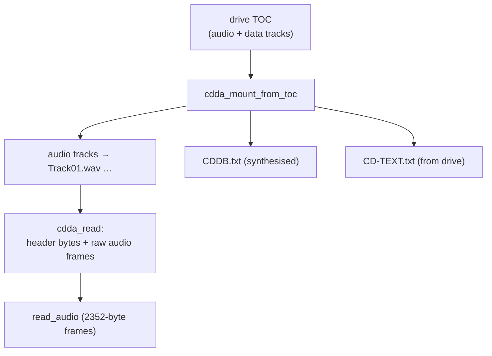
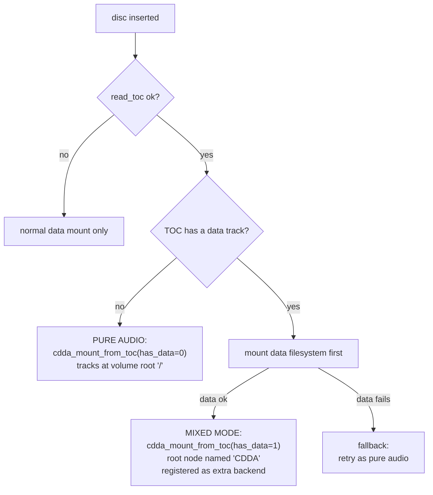
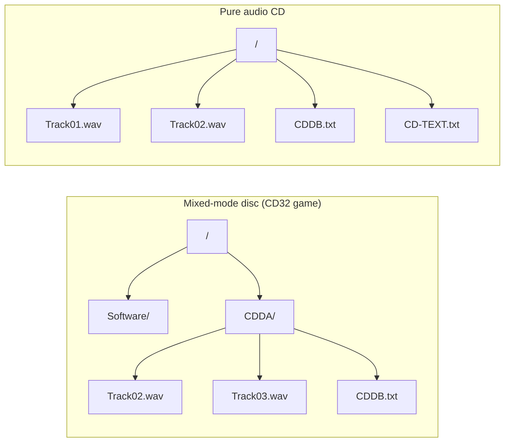
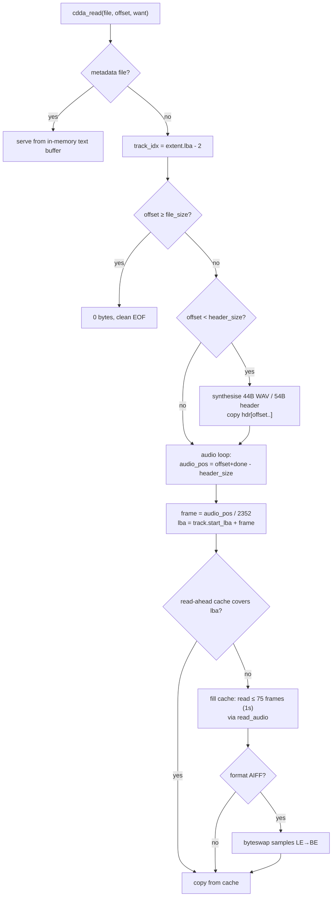

# CDDA Backend — Audio CDs as Files

The CDDA backend (`backends/cdda/`) is the odd one out. Every other backend parses
an on-disc filesystem; this one **synthesises** a filesystem out of an audio CD's
table of contents. Each Red Book audio track becomes a virtual `TrackNN.wav` (or
`.aiff`) file whose bytes are a WAV/AIFF header followed by the raw CD audio, read
on demand from the drive. It also fabricates two metadata text files — `CDDB.txt`
and `CD-TEXT.txt` — from the TOC and the drive's CD-Text.



## Why it can't use the normal probe path

The standard backend contract gives `probe`/`mount` a *cache*, not a *media*
handle. But detecting an audio CD requires the **TOC**, and the cache has no TOC
operation. So `cdda_probe` and `cdda_mount` are deliberate stubs that return
`BAD_FORMAT`/`UNSUPPORTED` (`cdda.c:668`, `:781`) — present only to satisfy the
vtable. The real entry point is an exported function the **handler** calls
directly:

```c
odfs_err_t cdda_mount_from_toc(odfs_toc_t *toc, int has_data_session, ...);  // cdda.c:701
```

This is the one backend driven from outside the mount engine. The handler decides
whether the disc is pure-audio or mixed-mode and calls it accordingly.

## The mixed-mode graft



The handler logic lives at `handler_main.c:3168`–`3257`. In **mixed mode** the CDDA
root node is named `"CDDA"` and registered via `odfs_mount_register_backend`
(see [architecture.md](architecture.md#dispatch-after-mount-the-backend-map)), so
it appears as a `CDDA/` subdirectory grafted onto the data filesystem. In **pure
audio** mode the root is `"/"` and tracks live at the volume root. The
`has_data_session` argument — not the TOC contents — is what selects the layout
(`cdda.c:763`).



## Track enumeration

`cdda_mount_from_toc` walks the TOC (`cdda.c:723`), keeping only **audio** tracks
(`control & 0x04` clear — data tracks are skipped). Track length comes from the next
entry's start, or the leadout; a track with no derivable length is dropped. Each
accepted track becomes a `cdda_track_t` with its start LBA, frame count, and total
file size (header + PCM).

### The virtual node encoding

CDDA nodes carry no `backend_data`; everything routes through `id` and
`extent.lba`:

| Field | Value | Purpose |
| --- | --- | --- |
| `id == 0` | root / `CDDA` dir | the directory node |
| `id == 1..99` | track number | identity |
| `extent.lba == i + 2` | track index + 2 | reverse lookup in `read` |
| `id == 0x43444442` (`"CDDB"`) | sentinel | `CDDB.txt`, LBA `0xfffffffe` |
| `id == 0x43445458` (`"CDTX"`) | sentinel | `CD-TEXT.txt`, LBA `0xfffffffd` |
| `kind` | `ODFS_NODE_VIRTUAL` | tracks & metadata files |

The sentinel LBAs (`cdda.c:30`) deliberately sit outside the `i+2` track index space
so `read` can distinguish a metadata file from a track in O(1).

## Reading a track: header + audio splice

The genius of the read path (`cdda_read`, `cdda.c:876`) is that the synthetic
header and the real audio are spliced into one seamless byte stream. A read that
straddles the header/audio boundary is handled correctly.



### Byte order — the subtle part

Raw CD audio frames arrive as 16-bit **little-endian** PCM. WAV is little-endian,
so it passes through untouched. AIFF is big-endian, so every 16-bit sample is
byte-swapped (`cdda_byteswap_samples`, `cdda.c:521`). The headers themselves are
written with explicit endian helpers — WAV little-endian (`cdda.c:577`), AIFF
big-endian including the 80-bit IEEE-754 sample-rate constant for 44100 Hz
(`cdda.c:597`) — so header synthesis is host-endianness-independent.

### Read-ahead cache

A 1-second (75-frame ≈ 176 KB) read-ahead buffer (`cdda.c:540`) amortises the cost
of `read_audio` across sequential reads — important because raw audio reads are slow
and a media player streams linearly. On a read error the cache frame count is zeroed
so stale data can't be served. Audio read failures are **propagated**, never masked
with silence (`cdda.c:948`).

## Synthesised metadata files

### CDDB.txt

`cdda_generate_cddb` (`cdda.c:170`) builds a text file from the TOC alone — no
network. It computes the freedb-style disc ID (`cdda_disc_id`, `cdda.c:109`) and
emits `DISCID`, `TRACKS`, per-track offsets, totals, and a ready-to-paste
`cddb query` command so the user can look up track names manually.

### CD-TEXT.txt

`cdda_generate_cdtext` (`cdda.c:375`) parses the drive's raw CD-Text (MMC READ
TOC/PMA/ATIP format 0x05, 18-byte packs) into human-readable records — title,
performer, songwriter, ISRC, etc. — coalescing multi-pack fields and sanitising to
ASCII (DBCS text is left as a `<DBCS>` placeholder). Because CD-Text requires
`read_cdtext`, which only a real drive provides, this file is meaningful only on
Amiga hardware.

## Profile and platform notes

- **ROM profile disables CDDA entirely** (`ODFS_FEATURE_CDDA = 0`,
  `config.h:71`). All audio code, the `CDDA/` graft, and the pure-audio fallback
  compile out.
- **Host images cannot exercise CDDA** because the host media backend provides no
  TOC and no `read_audio` (see
  [media-layer.md](media-layer.md#host-implementation-file_mediac)). The unit tests
  (`tests/unit/test_cdda.c`) inject a fake media with those ops to drive the backend.

## Limitations summary

| Limitation | Where |
| --- | --- |
| Amiga-hardware-only (no host TOC/audio) | `file_media.c:447` |
| Track number formatting assumes ≤ 99 | `cdda.c:656` |
| `extent.length` truncates tracks > 4 GiB (size kept in 64-bit `node.size`) | `cdda.c:854` |
| CD-Text DBCS not decoded | `cdda.c` |
| CDDB is offline-only (no lookup) | `cdda.c:170` |
| `cdda_probe`/`cdda_mount` are non-functional stubs | `cdda.c:668` |
