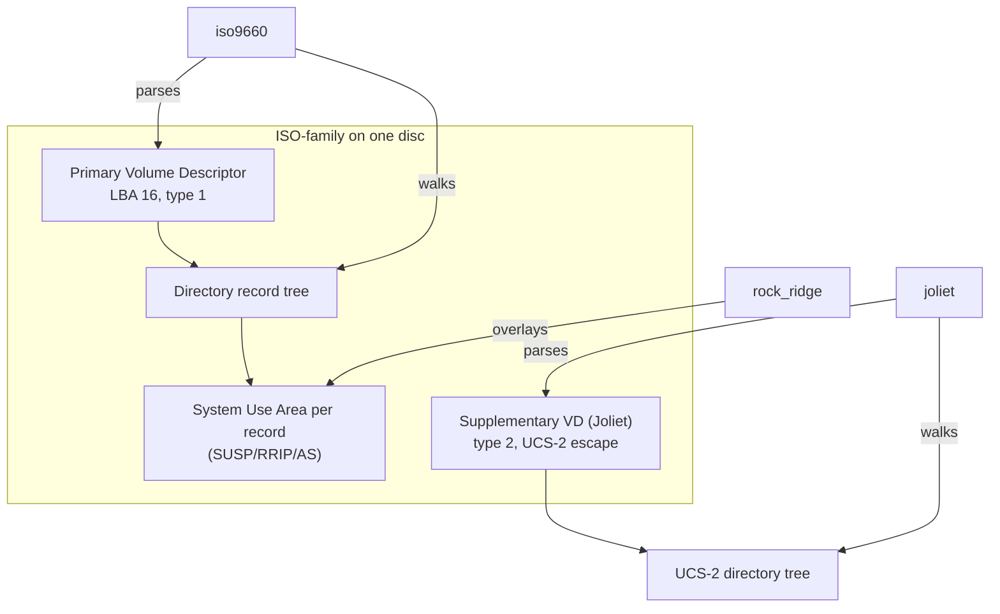
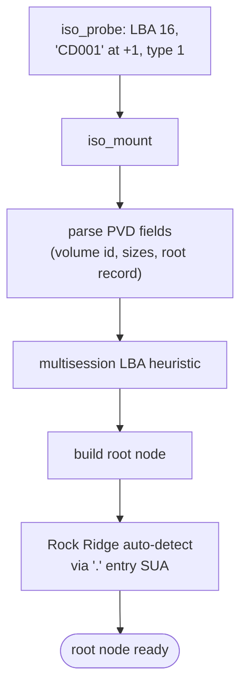
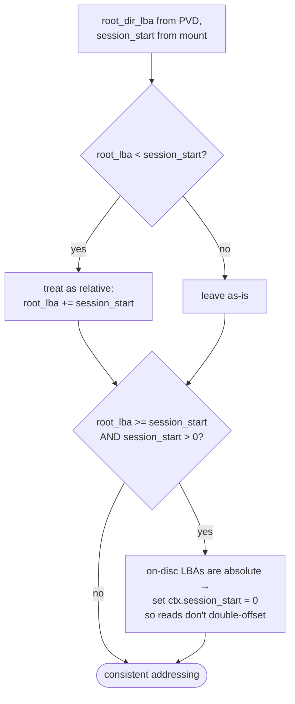
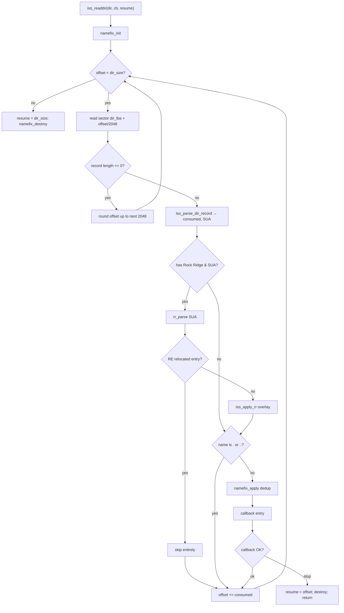
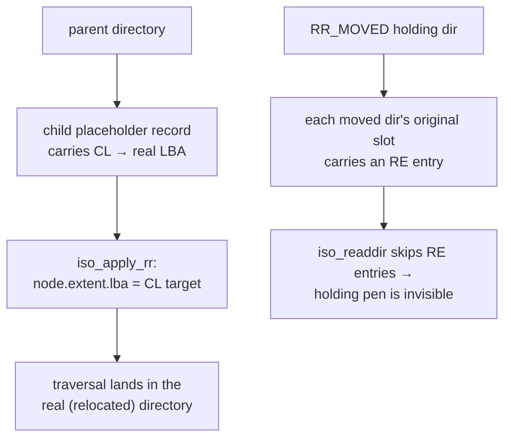
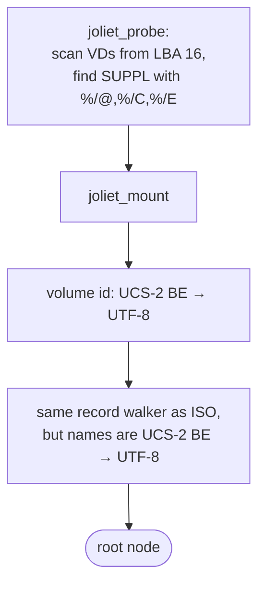
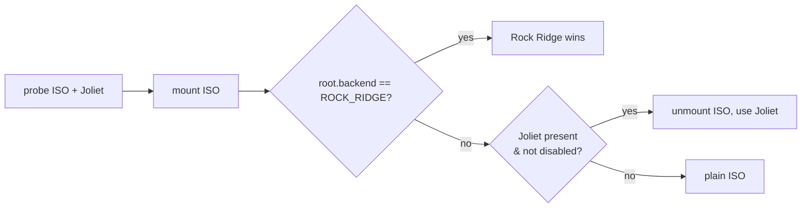

# ISO 9660 Family Backends

Three backends share the ECMA-119 on-disc geometry and most of the code:

- **iso9660** (`backends/iso9660/`) — the ECMA-119 base reader.
- **rock_ridge** (`backends/rock_ridge/`) — a SUSP/RRIP *parser library* layered
  onto ISO 9660 (it has no `odfs_backend_ops_t` of its own).
- **joliet** (`backends/joliet/`) — the UCS-2 Supplementary Volume Descriptor tree.

If you only learn one thing here: **Rock Ridge is not a separate backend.** It is
detected and applied from inside the ISO 9660 mount/readdir. That single fact
explains the probe order, the precedence rules, and why `mount.c` checks
`root.backend == ROCK_RIDGE` after mounting ISO.

## Shared design choices

- **Byte-offset constants, not packed structs.** Every on-disc layout is a set of
  `#define`d offsets (`iso9660.h:69`), read with explicit little-endian helpers.
  This is the right call for portable m68k cross-builds — no struct packing or
  alignment assumptions.
- **Both-byte-order fields, LE half only.** ECMA-119 stores integers twice (LE and
  BE). `iso_read_le32`/`iso_read_le16` (`iso9660.h:33`) always read the LE copy,
  which is correct on any host. The BE path-table offsets exist but are never read.
- **Path tables are ignored.** Directory traversal walks the directory extents
  directly. Path tables are an optimisation, not authoritative; skipping them is a
  legitimate read-only choice.
- **`backend_data` is unused.** Nodes are fully described by `extent`. `read`,
  `readdir`, and `lookup` recompute everything from `extent.lba`/`length`.
- **`lookup` is `readdir` + compare.** Every backend implements `lookup` by running
  its own `readdir` with a callback that does `odfs_strcasecmp` and stops early via
  the `ODFS_ERR_EOF` sentinel (translated back to `ODFS_OK`).

## ISO 9660 base reader

### What it parses

The Primary Volume Descriptor (`iso_mount`, `iso9660.c:209`) yields the volume id,
the logical block size, the volume space size (used as `total_blocks`), and the
embedded 34-byte root directory record. Directory records (`iso_parse_dir_record`,
`iso9660.c:98`) carry the extent LBA, data length, a 7-byte timestamp, flag bits
(directory / multi-extent / hidden), the name, and — after the name, padded to an
even boundary — the **System Use Area** where Rock Ridge lives.

The 7-byte timestamp (`iso_parse_dir_date`, `iso9660.c:31`): `year = 1900 + d[0]`,
raw month/day/hour/min/sec, and a timezone in 15-minute units. No range validation
— a corrupt field propagates into the node and is rejected later by the handler's
date converter.

### The multisession LBA heuristic

This is the cleverest 15 lines in the backend, and a place bugs love to hide.
Mastering tools disagree on whether on-disc root LBAs are session-relative or
absolute:

`iso9660.c:249`. The dual adjustment — add `session_start` if the LBA looks
relative, then zero the stored offset if the LBAs were already absolute — is what
makes `mkisofs -C` multisession discs work without reading file data from the wrong
place. Joliet mirrors the same logic (`joliet.c:218`). The session-level *candidate*
retry described in [media-layer.md](media-layer.md#multisession-discovery) is a
separate, complementary mechanism.

### readdir — the directory walker

`iso9660.c:346`. Records never span sectors in ISO 9660, so a zero-length record
means "padding to end of sector" — the walker rounds up. The **resume protocol**
advances `offset` *before* the callback and skips entries before the saved offset,
so a resumed listing points at the entry *after* the last delivered one. Note this
makes paginated listing O(n²): each resume re-walks from offset 0 and rebuilds the
namefix dedup list. Fine for optical directory sizes.

### read — single-extent only

`iso_read` (`iso9660.c:456`) clamps the request to the file size, then loops
2048-byte sectors from `extent.lba`, copying the relevant slice each time.

> **Limitation: multi-extent files are not assembled.** The `MULTI_EXTENT` flag
> (0x80) is defined but never honoured. A file split across multiple directory
> records reads only its first fragment. Realistic for the target media, but
> undocumented in the code itself.

## Rock Ridge (SUSP/RRIP) overlay

Rock Ridge adds Unix semantics — long names, POSIX modes, symlinks, real
timestamps — as **System Use** entries appended to each ISO directory record. The
parser (`backends/rock_ridge/rock_ridge.c`) reads a SUA byte buffer into an
`rr_info_t`; the ISO backend then overlays that onto the node.

### Entries that matter

| Entry | Meaning | Handling | Source |
| --- | --- | --- | --- |
| **SP** | SUSP present, skip count | Detected via `0xBE 0xEF` check bytes; skip count applied to every SUA | `rock_ridge.c:114` |
| **NM** | Alternate (long) name | Accumulated across `CONTINUE`-flagged parts; `.`/`..` NM ignored | `:169` |
| **PX** | POSIX mode/uid/gid | Sets `mode`; reclassifies node kind (SYMLINK/DIR/FILE) | `:188` |
| **TF** | Timestamps | CREATION→`ctime`, MODIFY→`mtime`; 7-byte or 17-byte ASCII form | `:202` |
| **SL** | Symbolic link target | Assembled from components, 250-byte payload cap | `:230` |
| **CL** | Child link (deep dir relocation) | Rewrites `extent.lba` to the real directory | `:296` |
| **RE** | Relocated entry placeholder | Marked `is_relocated` ⇒ hidden from listing | `:303` |
| **CE** | Continuation area | Recurses into another sector's SUA (depth ≤ 8) | `:307` |
| **AS** | Amiga protection + comment | Preserved verbatim into `amiga_as` | `:198`, `:29` |
| **ST** | Terminator | Stops parsing | `:326` |
| PL, ER, RR | Parent link / extensions ref / deprecated | Skipped | `:330` |

### Deep-directory relocation (CL / RE)

ISO 9660 limits directory nesting to 8 levels. Rock Ridge works around this by
*physically* moving deep directories under a special holding directory and leaving
links behind. ODFS makes this invisible:

Following a parent's `CL` link transparently jumps to the relocated directory
(`iso9660.c:69`), while `RE`-marked placeholders in the `RR_MOVED` directory are
dropped from enumeration (`iso9660.c:408`). Net effect: arbitrarily deep trees look
flat and correct.

### Continuation areas (CE)

A directory record's SUA is bounded by the record length. When Rock Ridge needs
more room, a `CE` entry points at a continuation sector. The parser recurses
(`rock_ridge.c:307`) with hard defenses: continuation length bounded to (0, 2048],
offset+length bounded within the sector, and recursion depth capped at 8. A
malformed `CE` chain cannot loop or read out of bounds.

### The Amiga `AS` extension

This is the Amiga-specific payload that makes ODFS special. The `AS` SUSP entry
carries the original 4-byte AmigaDOS protection field and a file comment, burned
onto Amiga CD32/CDTV discs. `rr_parse_as` (`rock_ridge.c:29`) preserves the
protection bytes verbatim (first-wins) and accumulates the comment across
continuation entries into `odfs_amiga_as_t` (`node.h:57`). The handler later maps
`protection[3]` straight onto the AmigaDOS `FIBF_*` bits and exposes the comment in
the `FileInfoBlock` — see
[amiga-handler.md](amiga-handler.md#protection-and-comment). This is exercised by a
real-world golden test against the *Arabian Nights* CD32 disc (see
[testing.md](testing.md)).

### What the overlay drops

`iso_apply_rr` (`iso9660.c:43`) applies NM, PX, TF, CL, and AS — but **not the SL
symlink target.** The parser fully assembles `symlink_target`, yet the node only
gets `kind = SYMLINK` (via the PX mode bits); the target string is discarded. This
is a known gap: symlinks appear as symlinks but resolve nowhere through the node
model.

## Joliet

Joliet is, structurally, ISO 9660 with a second volume descriptor (the
Supplementary VD, type 2) whose escape sequence (`%/@`, `%/C`, or `%/E` at offset
88) declares UCS-2 names. Joliet *replaces* the whole name tree, so Rock Ridge is
irrelevant on the Joliet view.

The parser (`joliet_parse_dir_record`, `joliet.c:46`) is the ISO record parser with
the name branch swapped for `odfs_ucs2be_to_utf8`, plus a trailing `;1` version
suffix strip. `readdir`/`read`/`lookup` are algorithmically identical to ISO,
including the multisession LBA heuristic. Joliet carries no Rock Ridge fields in its
context (`joliet_context_t`, `joliet.h:19`).

> **Minor divergence:** ISO breaks names at the first `;`; Joliet only strips a
> trailing 2-character `;X` suffix. A Joliet name like `FILE;12` keeps `FILE;1`.
> Cosmetic, but inconsistent.

## Selection recap

How these three interact at mount time (full rules in
[architecture.md](architecture.md#format-selection)):

## Defenses & limitations summary

| Concern | Status | Where |
| --- | --- | --- |
| Record bounds (len ≥ 33, name fits) | Checked | `iso9660.c:121`, `joliet.c:60` |
| SUA even-padding | Correct | `iso9660.c:161` |
| CE recursion / loops | Depth ≤ 8, bounded | `rock_ridge.c:155`, `:314` |
| SL payload overrun | 250-byte cap | `rock_ridge.c:244` |
| AS comment/protection bounds | Checked | `rock_ridge.c:40`, `:58` |
| Multi-extent files | **Not assembled** (first extent only) | `iso9660.c:456` |
| SL symlink target | **Parsed but dropped** | `iso9660.c:43` |
| Timestamp range | **Not validated** in parser | `iso9660.c:31` |
| Readdir pagination | O(n²) per resume | `iso9660.c:346` |
| `next_node_id` | Walk-transient, not stable identity | `iso9660.c:129` |
