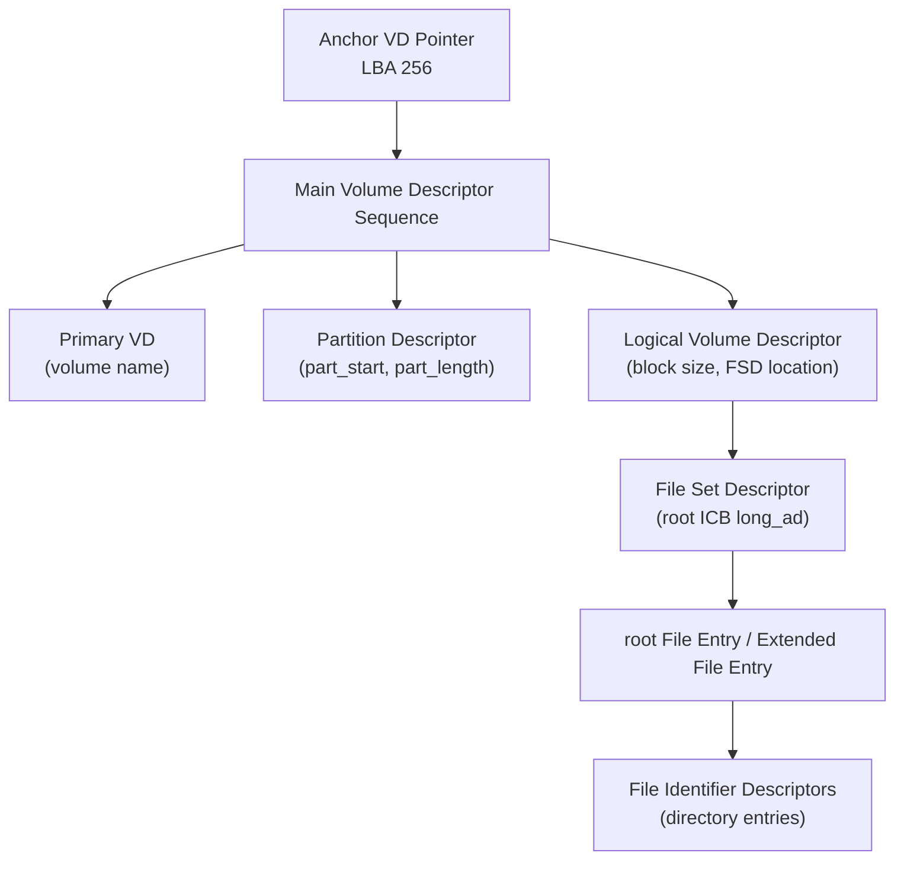
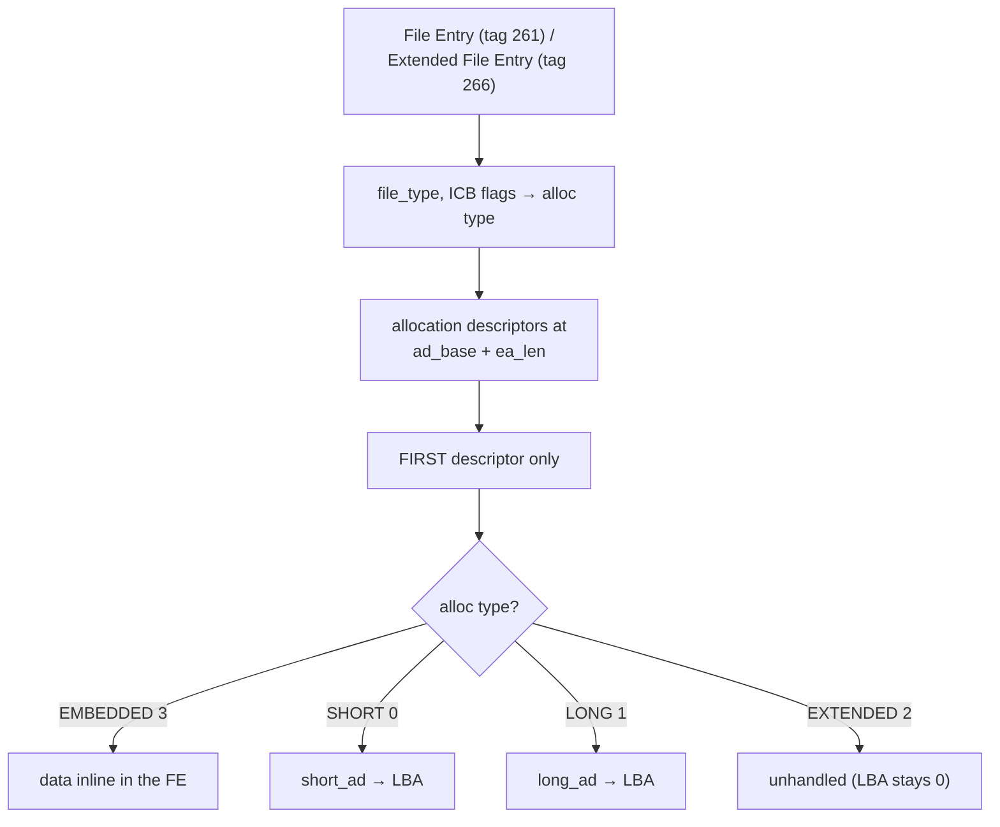
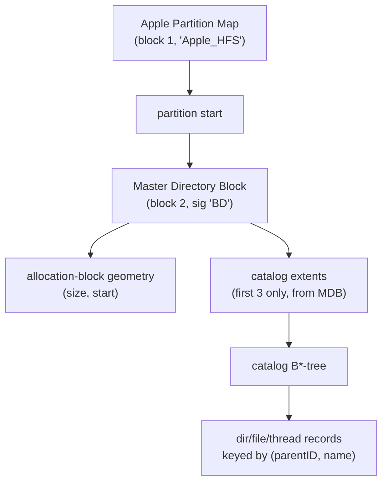
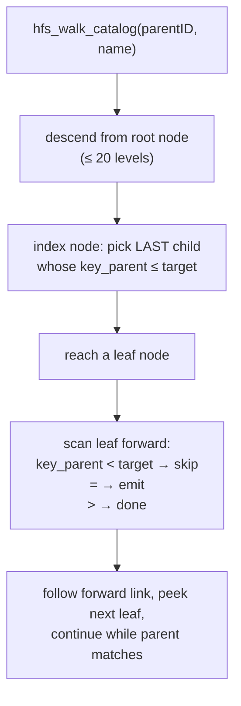
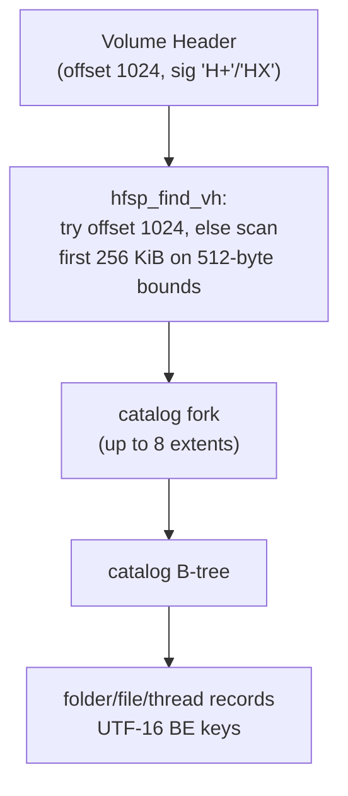
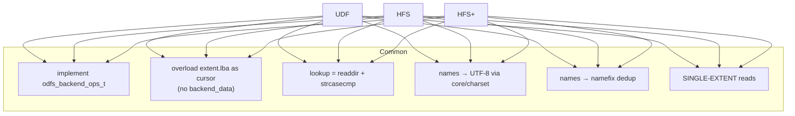

# UDF, HFS & HFS+ Backends

These three backends handle the "other" optical-disc worlds: UDF (DVDs, Blu-ray,
bridge CDs) and the Apple HFS/HFS+ family (Mac hybrid discs). They share two traits
with the ISO family — they implement `odfs_backend_ops_t`, and they overload
`extent.lba` as a backend cursor instead of using `backend_data` — but their
on-disc structures are completely different: UDF is a chain of ECMA-167
descriptors, and HFS/HFS+ are B-tree catalogs.

A second shared trait worth stating up front: **all three read only a single
extent of file data.** UDF honours one allocation descriptor; HFS and HFS+ read
only the first extent. This is the single most important correctness limitation in
this group and is called out per-backend below.

## UDF (`backends/udf/`)

### The descriptor chain

UDF doesn't have one superblock; it has a *chain* of descriptors you must follow
from a fixed anchor to reach the root directory.

`udf_mount` (`udf.c:181`) reads the **Anchor Volume Descriptor Pointer** at LBA 256
(`udf.c:151`), follows it to the Main VDS, and linearly scans descriptors
(`udf.c:222`), capturing the Partition Descriptor (`part_start`/`part_length`) and
the Logical Volume Descriptor (block size + File Set Descriptor location). The FSD
yields the root **ICB** long_ad; the ICB (a File Entry or Extended File Entry)
yields the directory's data location and metadata. Mount fails if either the
Partition or Logical Volume Descriptor is missing.

Every descriptor begins with a 16-byte tag that `udf_read_tag` (`udf.c:26`)
validates by checksum (the tag bytes only — the descriptor body CRC is *not*
verified).

### File Entries, ICBs, and the single-extent rule

`udf_read_icb` (`udf.c:364`) handles File Entry and Extended File Entry layouts
(different metadata offsets: size at 56, timestamp at 84 vs 108). It reads only the
**first** allocation descriptor (`udf.c:429`) and treats the file as one contiguous
extent. Directory enumeration (`udf_readdir`, `udf.c:484`) walks **File Identifier
Descriptors** with a sector-spanning byte reader, skipping `DELETED` and `PARENT`
entries, decoding names, and reading each child's ICB for size/type. `read`
(`udf.c:670`) re-resolves the ICB each call.

### Names and timestamps

UDF names are OSTA CS0 "compressed unicode": a leading compression-id byte selects
Latin-1 (id 8, byte copy) or UCS-2 BE (id 16, via `odfs_ucs2be_to_utf8`).
`udf_decode_dstring` (`udf.c:49`, length in the last byte, used for descriptor
fields) and `udf_decode_cs0` (`udf.c:92`, no trailing length, used for FID names)
handle the two forms. Timestamps (`udf.c:120`) are ECMA-167 format with a
minute-resolution timezone.

### UDF limitations

| Limitation | Consequence | Where |
| --- | --- | --- |
| Single allocation descriptor | Fragmented/large files read only first extent | `udf.c:429` |
| `EXTENDED` alloc type unhandled | Such files get LBA 0 | `udf.c` |
| Embedded-data offset not computed | Inline-data reads start at the FE tag, not the data | `udf.c` |
| Single physical partition assumed | Metadata/Virtual/Sparable partition maps ignored | `udf.c` |
| No body CRC / LVID / integrity check | Trusts descriptor bodies | `udf.c:26` |
| No explicit bridge detection | Bridge handling is implicit (AVDP at 256 regardless of ISO) | `udf.c:6` |

Bridge-disc precedence (ISO-family vs UDF) is decided in `core/mount.c`, not here —
see [architecture.md](architecture.md#format-selection).

## HFS (`backends/hfs/`)

HFS is Apple's classic Mac filesystem. ODFS reads it **data-fork-only** — resource
forks and Finder metadata are deliberately not exposed (a documented contract, not
an oversight).

### Volume layout and the catalog B*-tree

`hfs_mount` reads the **Master Directory Block** at block 2 (`hfs.h:17`), optionally
behind an Apple Partition Map (`hfs.c:198`). The catalog B*-tree is reachable
through the first three extents recorded in the MDB.

> **Limitation: only 3 catalog extents.** The extents-overflow file is not
> consulted, so a heavily fragmented catalog (>3 extents) cannot be fully read.

### B-tree traversal

`hfs_walk_catalog` (`hfs.c:353`) descends the index nodes choosing the last child
≤ the target parent id, then scans leaves forward following the chain pointer.
`readdir` (`hfs.c:571`) uses `parent_cnid = dir->extent.lba`; directory nodes store
the CNID in `extent.lba`, file nodes store the first allocation block. `read`
(`hfs.c:612`) maps the first allocation block to a byte offset
(`hfs_ab_to_byte`, `hfs.c:71`) and reads sequentially — **first extent only.**

Names are Mac Roman → UTF-8 with AmigaDOS-safe remapping (`:`→`.`, `/`→`-`, controls
→`?`, `hfs.c:150`). Mac dates use the 1904 epoch (`hfs.c:32`).

## HFS+ (`backends/hfsplus/`)

HFS+ is the modern evolution: a Volume Header, Unicode (UTF-16) names, and forks
with up to eight inline extents. ODFS is again **data-fork-only**.

### What HFS+ does better than HFS

The catalog is read through its proper **fork** (`hfsp_read_fork`, `hfsplus.c:83`),
which walks up to 8 fork extents — so a moderately fragmented catalog is fully
readable, unlike HFS's 3-extent cap. The Volume Header discovery (`hfsplus.c:180`)
first tries the bare offset, then signature-scans the first 256 KiB to handle
GPT/APM wrappers.

B-tree traversal mirrors HFS (descend ≤ 20 levels, scan leaves by forward link,
`hfsplus.c:401`). Names are UTF-16 BE → UTF-8 with `:`→`.` remapping
(`hfsplus.c:164`). Private directories (key name starting with `.`, e.g. the
`HFS+ Private Data` store) are filtered out (`hfsplus.c:504`). The volume name comes
from the root folder-thread record in the first leaf (`hfsplus.c:325`), falling back
to the literal `"HFS+"`.

> **The fork-reader paradox:** `hfsp_read_fork` supports multi-extent reads, but
> `hfsp_read` (`hfsplus.c:593`) deliberately uses only the **first** extent ("covers
> most small files"). So the catalog can span extents but *file data* cannot. Large
> or fragmented files read incorrect data past the first extent.

### HFS / HFS+ limitations

| Limitation | Consequence | Where |
| --- | --- | --- |
| Data fork only | Resource forks / Finder metadata invisible | `hfs.c:8`, `hfsplus.c` |
| First-extent-only reads | Large/fragmented files truncated | `hfs.c:612`, `hfsplus.c:593` |
| HFS: 3 catalog extents | Fragmented catalog unreadable | `hfs.c` |
| HFSX case-sensitivity ignored | `lookup` is always case-insensitive | `hfsplus.c:656` |
| No journal / attributes / hardlinks | Indirect-node hardlinks, xattrs unsupported | — |
| decmpfs compression unhandled | Compressed files appear empty/partial | — |
| VH scan is a signature match | Could in principle false-match arbitrary data | `hfsplus.c:180` |

## Cross-cutting summary

| Property | UDF | HFS | HFS+ |
| --- | --- | --- | --- |
| Anchor | AVDP @ LBA 256 | MDB @ block 2 | VH @ offset 1024 |
| Names | OSTA CS0 (Latin-1 / UCS-2) | Mac Roman | UTF-16 BE |
| Date epoch | ECMA-167 | 1904 | 1904 |
| Directory cursor (`extent.lba`) | physical ICB LBA | CNID | CNID |
| File cursor (`extent.lba`) | physical ICB LBA | first alloc block | first start block |
| Multi-extent catalog | n/a | 3 (MDB) | up to 8 (fork) |
| Multi-extent file data | no (1 AD) | no (1st) | no (1st) |
| Resource forks | n/a | not exposed | not exposed |

All three are **fully host-testable** (unlike CDDA) because they need only cooked
2048-byte sector reads, which the host media backend provides. Their golden and
fuzz coverage is described in [testing.md](testing.md).
