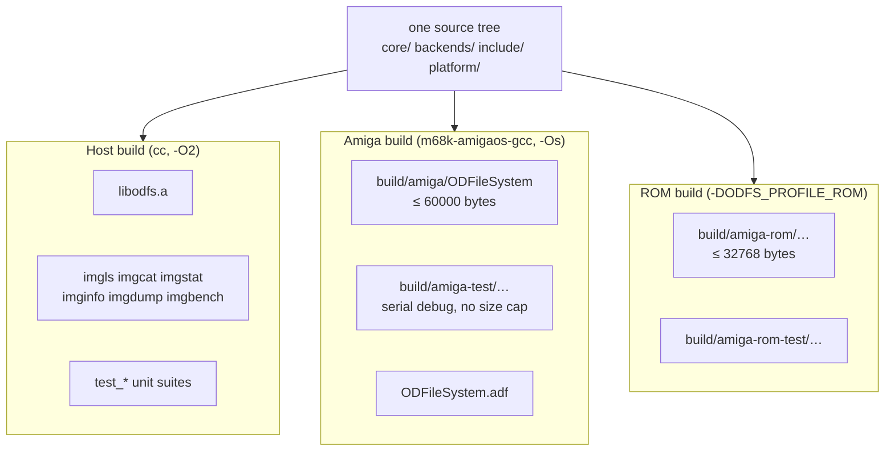
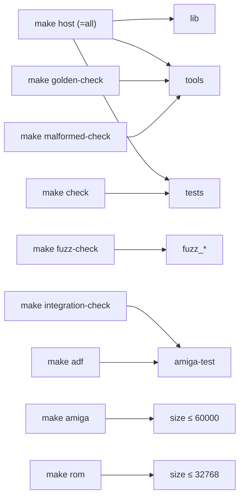
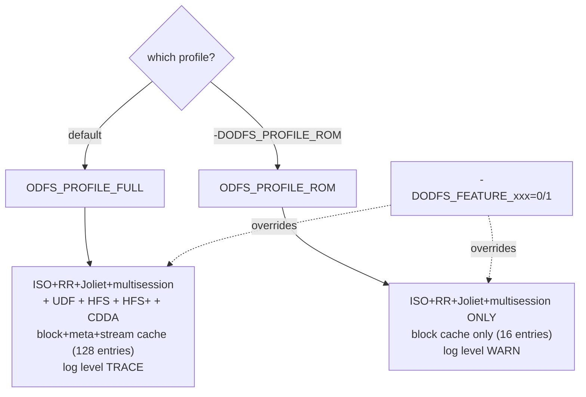
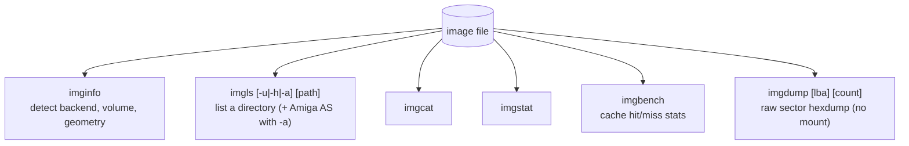
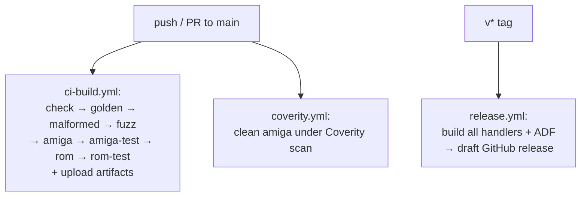

# Build System, Profiles & Tooling

ODFS builds three very different artifacts from one source tree: a **host library +
tools + tests** (your laptop), a **full Amiga handler** (m68k cross), and a
**ROM-profile handler** (a smaller subset). The `Makefile` orchestrates all of it,
and a set of feature macros decide what compiles in. This document maps the targets,
the toolchains, the feature/profile flags, the size budgets, and the host tools.

## The big picture



## Toolchains

| Build | Compiler | Optimisation | Notable flags |
| --- | --- | --- | --- |
| Host | `cc` (`HOSTCC`) | `-O2` | `-std=c11 -Wall -Wextra -Wpedantic -Werror -Wshadow` |
| Amiga | `m68k-amigaos-gcc` | `-Os` (size) | `-m68000 -mtune=68020-60 -msoft-float -noixemul -nostartfiles` |
| AROS | `m68k-aros-gcc` (`AROS=1`) | `-Os` | `-static -nostartfiles -D__AROS__` |

The Amiga target builds for the **baseline 68000** ISA (so it runs on any Amiga),
tuned for 020–060, with soft float. The handler links bare-metal
(`-nostdlib -lgcc -lc -lamiga`) against a hand-written `platform/amiga/startup.S`,
then is stripped. Size — not speed — is the optimisation axis, because the handler
lives under a strict byte budget. See [amiga-handler.md](amiga-handler.md#freestanding-runtime)
for why the freestanding runtime needs `printf_local.c` and `libc_stubs.c`.

## Targets



| Target | Produces / does |
| --- | --- |
| `host` (`all`) | host library, tools, unit-test binaries |
| `check` | build + run every `test_*` suite; non-zero exit on any failure |
| `golden-check` | run golden image scripts (`test_formats.sh`, real-AS fixture) |
| `malformed-check` | run malformed-image robustness scripts |
| `fuzz-check` | build `fuzz_*` and run the parser fuzz smoke harness |
| `integration-check` | AmiFUSE end-to-end test using the `amiga-test` handler |
| `amiga` | release handler → `build/amiga/`, **enforces size limit** |
| `amiga-test` | debug handler (serial logging on, size cap off) |
| `rom` | release ROM handler → `build/amiga-rom/`, ROM size limit |
| `rom-test` | debug ROM handler |
| `adf` | bootable `ODFileSystem.adf` (handler in `L`, test tool in `C`, `CD0` mountlist) via `xdftool` |
| `size` | `m68k-amigaos-size` breakdown of the Amiga library |
| `clean` | `rm -rf build` |

## Feature & profile flags

Two layers of configuration, both resolved in `include/odfs/config.h`:



- **Per-backend feature flags** (`ODFS_FEATURE_ISO9660`, `…_UDF`, `…_HFS`,
  `…_CDDA`, …) gate which backends compile in and register in the table
  (`core/mount.c:36`). The ROM profile sets UDF/HFS/HFS+/CDDA to 0.
- **Cache flags** select block-only (ROM) vs block+meta+stream (full), and the
  default cache size (16 vs 128 entries).
- **Logging flags** set the level ceiling and whether serial/ring-buffer sinks
  compile in. `SERIAL_DEBUG` drives both `ODFS_SERIAL_DEBUG` and `ODFS_FEATURE_LOG`,
  so release builds compile logging out entirely.

The Makefile injects these as `-D` flags (`FEATURE_DEFS`), along with the version
string (`git describe`) and build date.

## Size budgets

The handler has hard size ceilings, enforced at link time:

| Profile | Limit | Override |
| --- | --- | --- |
| Full Amiga | `AMIGA_SIZE_LIMIT = 60000` | `make amiga AMIGA_SIZE_LIMIT=<bytes>` |
| ROM | `ROM_SIZE_LIMIT = 32768` | `make rom ROM_SIZE_LIMIT=<bytes>` |

The `amiga` target measures the final binary with `wc -c` and fails the build if it
exceeds the limit (unless `ENFORCE_SIZE_LIMITS=0`, as in the `-test` builds). The
error message names the relevant limit variable. The ROM limit was recently raised
to 32 KB (commit `59bf94f`). This is why `-Os`, the freestanding runtime, and the
ROM feature subset all exist — every kilobyte is accounted for.

## Host tools

Six thin CLI drivers over the public API, all built into `build/host/tools/`. They
share one lifecycle: open image → mount → operate → unmount. They are also the
golden-test harness's instruments.



| Tool | Exercises | Notes |
| --- | --- | --- |
| `imginfo` | `odfs_mount`, geometry | Tolerant: prints geometry even if mount fails (malformed corpus) |
| `imgls` | `odfs_resolve_path`, `odfs_readdir` | `-u`/`-h` force UDF/HFS precedence; `-a` dumps `amiga_as` |
| `imgcat` | `odfs_read` loop | 8 KiB chunks until EOF |
| `imgstat` | `odfs_resolve_path` | Decodes protection into `hsparwed` text |
| `imgbench` | `odfs_cache_get_stats` | Reports cache behaviour incurred during mount |
| `imgdump` | `odfs_media_read` (no mount) | Raw layer; default LBA 16 = the ISO PVD |

## CI

Three GitHub workflows, all in the `stefanreinauer/amiga-gcc` container:



The CI gate is comprehensive: every push must pass unit tests, golden image tests,
malformed-image robustness, parser fuzz smoke tests, and build all four handler
variants — with warnings-as-errors throughout. See [testing.md](testing.md) for
what each suite asserts.

## libcodesets

`.gitmodules` references `3rdparty/libcodesets` (Jens Maus's Amiga
`codesets.library`). The Makefile *opportunistically* inits it if a git checkout is
present, but **nothing in the build, link, or test path depends on it** — charset
conversion is fully self-contained in `core/charset.c`
([core-layer.md](core-layer.md#charset-conversion-charsetc)). It is present as a
reference/optional submodule, not a build dependency; shipping the project's own
minimal charset code keeps the handler dependency-free and within its size budget.

## Quick reference

```sh
make            # host lib + tools + tests
make check      # run unit tests
make golden-check malformed-check fuzz-check   # image-based suites
make amiga      # release handler (≤ 60000 bytes), serial off
make amiga-test # debug handler, serial on, no size cap
make rom        # release ROM handler (≤ 32768 bytes)
make adf        # bootable test disk for an emulator
make size       # size breakdown of the Amiga library
```
