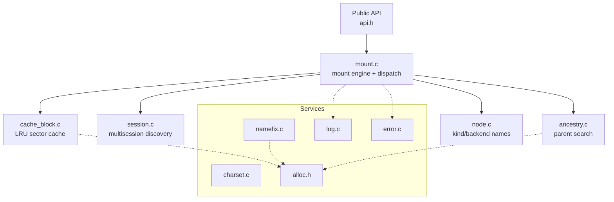
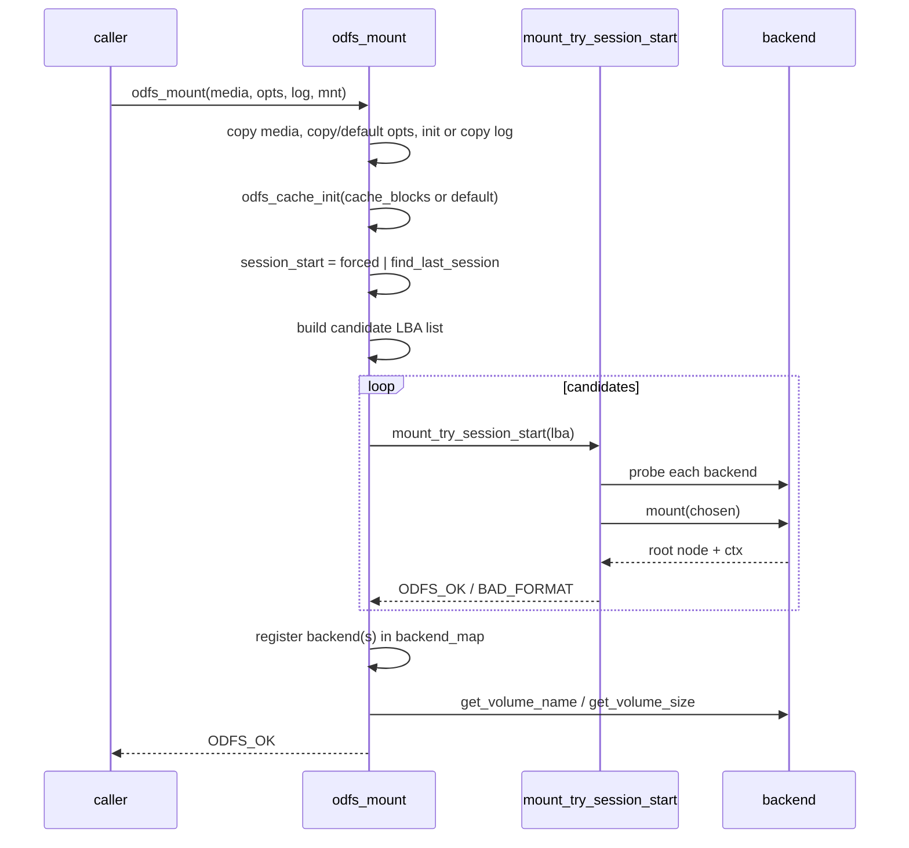
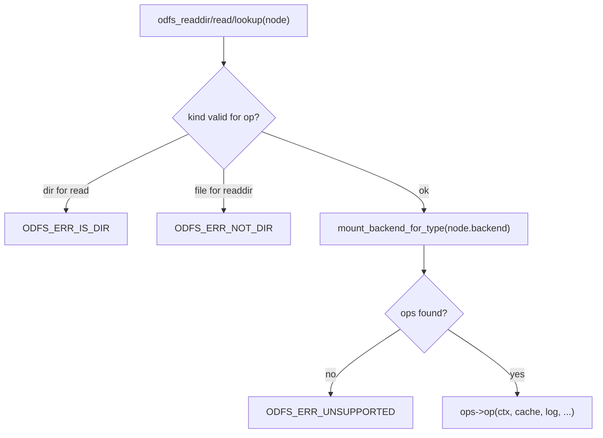
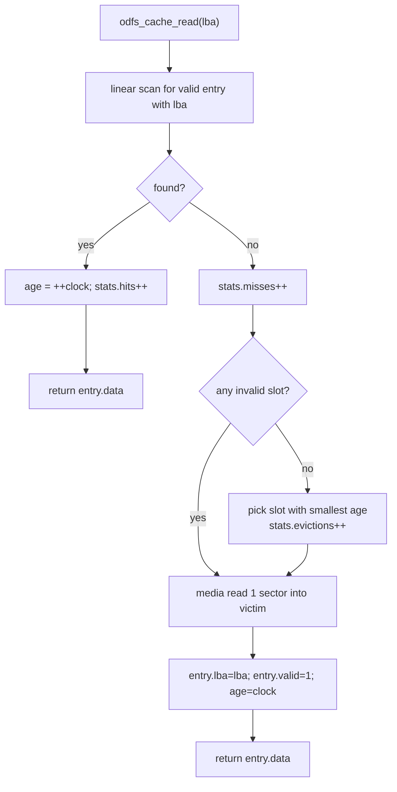
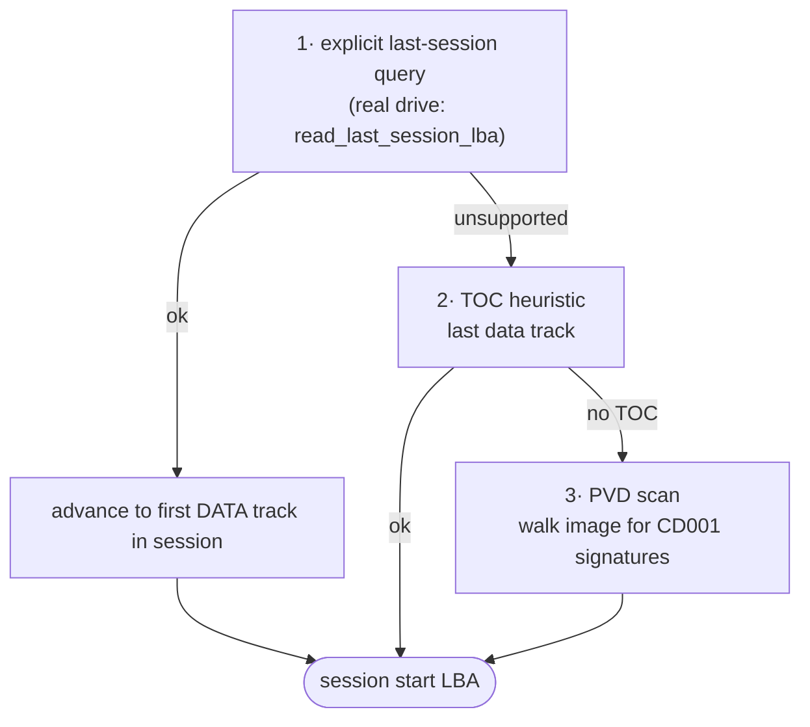
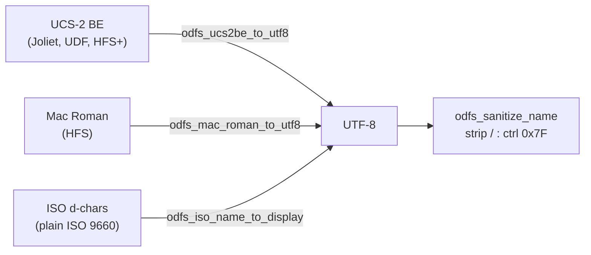
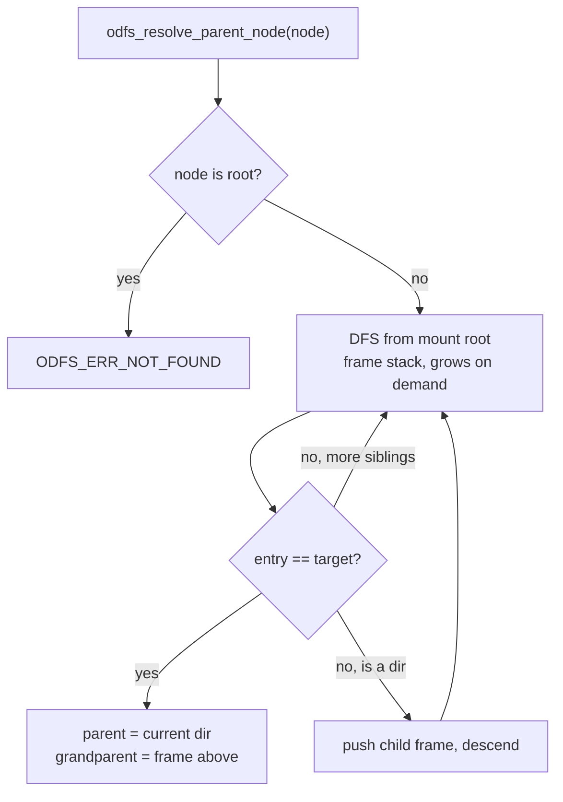
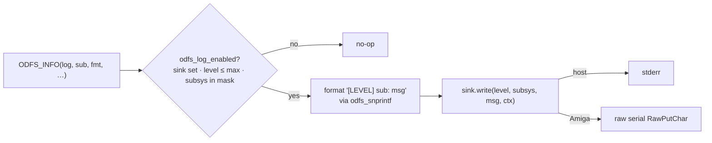

# Core Layer (`core/`)

The core is the portable engine: ~1,500 lines of plain C11 that compile and run
unchanged on a host. It owns the node model, the mount/selection logic, path
resolution, the block cache, and a handful of standalone services. This document
walks each module, its data structures, and the invariants you must keep.



## The node model

`odfs_node_t` (`include/odfs/node.h:65`) is the lingua franca of the whole system.
See [architecture.md](architecture.md#the-internal-object-model) for the field
diagram. The contract, restated as rules:

- **Pass by value.** Nodes are `memcpy`-copyable. Locks, file handles, and
  directory-iteration frames all *store* nodes, not pointers to them.
- **`extent` is the source of truth.** `extent.lba` + `extent.length` (plus
  `backend`) is all a backend needs to re-derive everything at `read`/`readdir`
  time. Several backends overload `extent.lba` as a backend-specific cursor:

  | Backend | `extent.lba` for a directory | `extent.lba` for a file |
  | --- | --- | --- |
  | ISO/Joliet/RR | directory extent LBA | file extent LBA |
  | UDF | physical ICB LBA | physical ICB LBA |
  | HFS | catalog node id (CNID) | first allocation block |
  | HFS+ | catalog node id (CNID) | first fork start block |
  | CDDA | n/a (root) | track index + 2 (reverse lookup) |

- **Identity ≠ id.** `odfs_node_matches_identity()` (`node.h:86`) compares
  backend + kind + size + extent + name. The `id`/`parent_id` fields are
  *transient* — backends bump a per-mount counter during each directory walk, so
  the same on-disc entry gets a different id on every enumeration. Never persist
  or compare `id`. The Amiga handler derives its stable lock/DiskKey from
  `(backend << 28) | extent.lba` instead (`handler_main.c:1139`).

`node.c` itself is tiny (`core/node.c`): it only provides
`odfs_backend_type_name()` and `odfs_node_kind_name()` for diagnostics.

## The mount engine (`mount.c`)

`mount.c` is the busiest core file. It does five things: initialise the cache,
discover sessions, select a format, build the per-backend dispatch map, and route
post-mount calls. Format selection and the session candidate loop are documented
in [architecture.md](architecture.md#format-selection) and
[media-layer.md](media-layer.md#multisession-discovery); here we focus on the
*dispatch* machinery and lifecycle.

### Lifecycle



`odfs_unmount` (`core/mount.c:432`) is the mirror image, with one subtlety: it
walks `backend_map[]` and unmounts each distinct `(ops, ctx)` pair exactly once —
because a mixed-mode mount registers the *same* backend under more than one type
key, naive iteration would double-free. The dedup loop at `core/mount.c:449`
guards against that, and a `primary_seen` flag ensures the active backend is
unmounted even if it isn't in the map.

### The dispatch map

After selection, `odfs_mount` registers the active backend under both its node
type and its ops type (`core/mount.c:413`). Additional backends (CDDA) are
registered later by the handler. Every public operation resolves the backend the
same way:



`mount_backend_for_type` (`core/mount.c:240`) checks the explicit map first, then
falls back to the active backend if the node's type matches either the root
backend or the ops' declared type. This indirection is what lets one mount serve
ISO nodes and CDDA nodes side by side.

### Path resolution

`odfs_resolve_path` (`core/mount.c:539`) is a straightforward component walker
over `/`-separated paths, starting from the mount root. Its one clever move is
intercepting **virtual roots by name** before falling through to `odfs_lookup`
(`core/mount.c:580`) — so a path like `CDDA/Track01.wav` jumps into the audio
backend's virtual root, then `Track01.wav` is looked up *within* that backend. The
Amiga handler has its own richer path walker (`resolve_amiga_path`,
`handler_main.c:1376`) that additionally understands AmigaDOS `/`-as-ascend and
assign prefixes; see [amiga-handler.md](amiga-handler.md#path-resolution).

## The block cache (`cache_block.c`)

Every byte a backend reads passes through here. It is a fixed-capacity, fully
associative LRU cache of 2048-byte sectors keyed by absolute LBA.



Design notes a senior reader will care about:

- **Fully associative, linear scan.** Lookup is O(capacity) per read. With 16
  (ROM) to 128 (full) entries this is trivially cheap and avoids any hashing or
  bucket structure — the right call for the size budget. `include/odfs/cache.h:34`.
- **Approximate LRU via a monotonic clock.** Each access stamps `age = ++clock`;
  eviction picks the smallest age (`core/cache_block.c:105`). No doubly-linked LRU
  list to maintain.
- **Buffers allocated up front.** `odfs_cache_init` allocates one sector buffer per
  entry and rolls them all back on partial OOM (`core/cache_block.c:30`). After
  init, reads never allocate — important on a memory-constrained Amiga.
- **One sector per call.** The cache reads exactly one sector on a miss
  (`odfs_media_read(..., 1, ...)`). Backends that want a run of sectors loop over
  single-sector reads; the cache absorbs re-reads of the same sector within a
  directory record or file extent.
- **Telemetry.** `odfs_cache_stats_t` tracks reads/hits/misses/evictions and a
  high-water mark, surfaced by the `imgbench` tool and the unit tests.
- **Flush, not coherence.** `odfs_cache_flush` just marks every entry invalid
  (`core/cache_block.c:63`); the handler calls it on media change. There is no
  write path, so there is no coherency problem to solve.

## Multisession discovery (`session.c`)

`odfs_find_last_session` (`core/session.c:37`) finds where the *current* session
begins, using three strategies in order. This is covered in depth in
[media-layer.md](media-layer.md#multisession-discovery); the short version:



Strategy 3 is the host-image path: with no TOC available, it scans every plausible
PVD location (`session_start + 16`) for the `CD001` signature and jumps past each
session using its declared volume size (`core/session.c:143`). On total failure it
returns LBA 0, the safe default.

## Auxiliary services

### Charset conversion (`charset.c`)

Self-contained, no external library (the `libcodesets` submodule is *not* used —
see [build-system.md](build-system.md#libcodesets)). All names converge on UTF-8.



- `odfs_utf8_append` (`core/charset.c:10`) is the shared encoder, handling up to
  U+10FFFF and emitting `'?'` for out-of-range code points. Every branch is bounds
  checked against the destination size.
- `odfs_ucs2be_to_utf8` (`:43`) rejects odd lengths, stops at a NUL code unit, and
  is used by Joliet, UDF (comp-id 16), and HFS+.
- `odfs_mac_roman_to_utf8` (`:74`) carries the full 128-entry Mac Roman high-half
  table.
- `odfs_iso_name_to_display` (`:124`) breaks at the `;` version separator, strips a
  trailing `.` on directories, and optionally lowercases.
- `odfs_sanitize_name` (`:154`) replaces control characters and the AmigaDOS-toxic
  `/` and `:`. (Note: the ISO-family backends do *not* call this — see the backend
  docs for where sanitisation happens and doesn't.)

### Deterministic name dedup (`namefix.c`)

AmigaDOS is case-insensitive; Rock Ridge, Joliet, UDF, and HFS+ are not. So
`README` and `readme` can coexist on disc but must not collide in the AmigaDOS
view. `odfs_namefix_apply` (`core/namefix.c:68`) resolves this deterministically.

```mermaid
flowchart TD
    Apply["odfs_namefix_apply(name)"] --> Seen{seen before<br/>(case-insensitive)?}
    Seen -->|no| Remember[remember name] --> Ok1([keep as-is])
    Seen -->|yes| Loop["try ~2, ~3, … up to ~999999"]
    Loop --> Fit[truncate base to fit name_size]
    Fit --> Free{this suffixed name free?}
    Free -->|yes| Remember2[remember] --> Ok2([renamed])
    Free -->|no| Loop
```

The dedup state is a per-directory-walk singly-linked list, rebuilt from scratch
on every `readdir` call. Because backends always enumerate on-disc entries in the
same order, the suffix assignment is **stable and order-dependent**: the first
on-disc entry keeps the unsuffixed name; later collisions get `~2`, `~3`, … in
on-disc order. The cost is O(n²) for a directory of n entries (linear scan per
entry); fine for optical-disc directory sizes. This is the policy the README calls
the "name collision policy".

### Parent/ancestor search (`ancestry.c`)

AmigaDOS `ACTION_PARENT` needs the parent of an arbitrary node, but most backends
only know how to walk *down* (a directory record points at children, not at its
parent — and Rock Ridge `PL` parent links are not reconstructed). `ancestry.c`
solves this with a bounded depth-first search from the root.



`odfs_resolve_parent_node` (`core/ancestry.c:53`) maintains an explicit, growable
frame stack (no recursion, so no stack blowout on deep trees) and uses the
`ODFS_ERR_EOF` sentinel from the readdir callback to stop early on a match or to
descend into the first unexplored subdirectory. It returns both the parent and the
grandparent in one pass, which is exactly what the handler needs to build a parent
lock. It is, by nature, O(tree) in the worst case — acceptable because
`ACTION_PARENT` is rare and the handler short-circuits common cases (parent is the
mount root or a CDDA virtual root) before calling it (`handler_main.c:1746`).

### Logging (`log.c`)

A small structured logger: levels `FATAL…TRACE`, subsystem tags (`mount`, `iso`,
`udf`, `cache`, …), a per-state level threshold and subsystem bitmask, and a single
pluggable sink.



The `ODFS_FEATURE_LOG` flag (`include/odfs/config.h`) compiles the macros down to
no-ops in release builds, so a quiet handler carries zero logging overhead. On the
Amiga the sink is raw serial output and is wired only when `ODFS_SERIAL_DEBUG` is
set (`handler_main.c:921`); on the host, tools install a stderr sink. The level
ceiling `ODFS_LOG_MAX_LEVEL` is `TRACE` for full builds and `WARN` for ROM
(`config.h:101`).

### Errors (`error.c`)

`odfs_err_t` (`include/odfs/error.h:10`) is a flat enum of ~20 codes —
generic (`NOMEM`, `IO`, `INVAL`), media (`NO_MEDIA`, `MEDIA_CHANGED`), format
(`BAD_FORMAT`, `UNSUPPORTED`, `CORRUPT`, `LOOP`), and handler
(`NOT_DIR`, `IS_DIR`, `EOF`). `odfs_err_str` maps them to strings for logging and
tools. The Amiga handler has a separate `odfs_err_to_dos` table
(`handler_main.c`/`handler.h:172`) translating these into AmigaDOS error codes;
notably `ODFS_ERR_EOF → 0`, so end-of-file is a short read, not an error. The
`ODFS_ERR_EOF` value also doubles as an *early-stop sentinel* returned by readdir
callbacks throughout the codebase (lookup, ancestry, `Examine` iteration).

### The allocator seam (`alloc.h`)

`include/odfs/alloc.h` is a compile-time fork: on the Amiga, `odfs_malloc`/
`odfs_calloc`/`odfs_free` map to exec `AllocVec`/`FreeVec` with `MEMF_PUBLIC`
(and overflow-checked `calloc`); on the host they map to libc. This single header
is why the same core code allocates correctly in both worlds without `#ifdef`s
scattered through the parsers. Long-lived Amiga handler structures (locks, file
handles, the volume node) bypass this and use raw `AllocMem` directly — see
[amiga-handler.md](amiga-handler.md#memory-management).

## What the core does *not* do

- It does not know about AmigaDOS, BSTRs, `FileLock`s, or packets — that is the
  handler's job.
- It does not read the device directly — everything goes through the cache and the
  media vtable.
- It does not assemble multi-extent files. Every backend's `read` assumes a single
  contiguous extent (or first-extent-only for HFS/HFS+). This is a known,
  documented limitation; see the backend documents.
- It does not validate timestamps. A corrupt month/day from a malformed record
  propagates into the node unmodified; the handler's date converter rejects
  out-of-range values when filling a `FileInfoBlock`.
