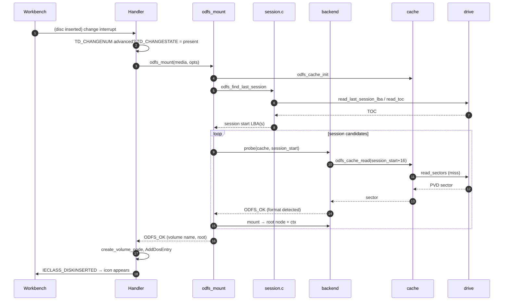
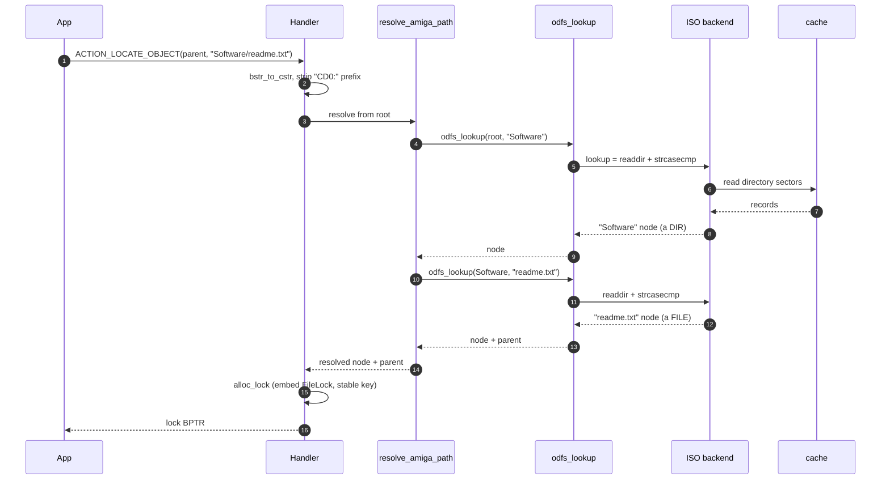
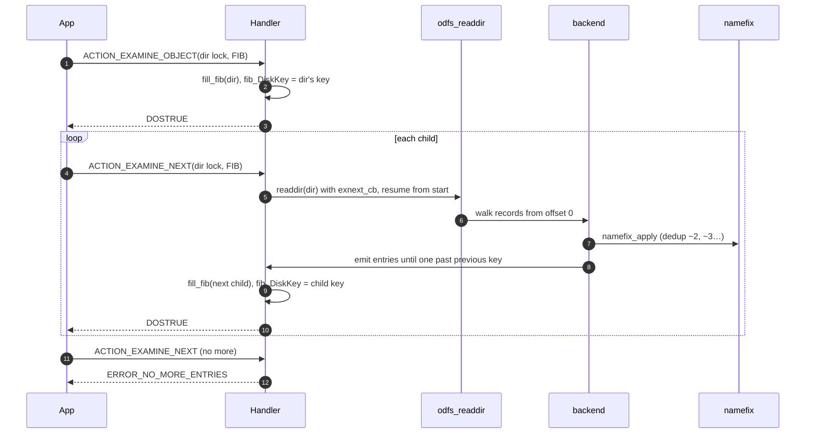
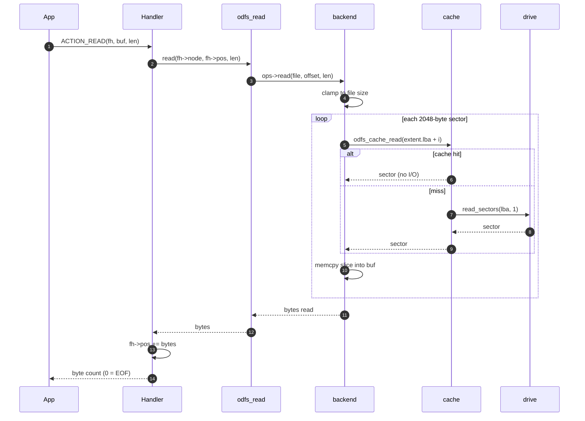
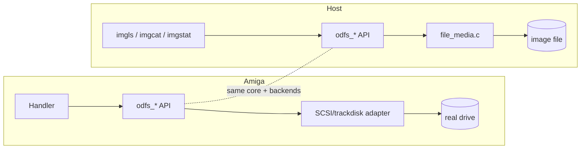

# End-to-End Data Flows

The per-layer documents explain each subsystem in isolation. This document does the
opposite: it traces a handful of real operations *through every layer*, from an
AmigaDOS application down to the spinning disc and back. If you want to understand
how the pieces actually cooperate at runtime, start here.

The cast, top to bottom: **App** (AmigaDOS/Workbench) → **Handler**
(`platform/amiga`) → **Core API** (`odfs_*`) → **Backend** (`backends/*`) →
**Cache** (`core/cache_block.c`) → **Media** (`odfs_media_t`) → **Drive/Image**.

## 1. Disc insert → mounted volume



What to notice:

- **Session discovery happens before any backend runs** — the mount engine decides
  *where* to look before deciding *what's there*. ([media-layer.md](media-layer.md#multisession-discovery))
- **Probe reads flow through the cache**, so the very first sectors a backend reads
  to detect a format are already warm when it mounts. ([core-layer.md](core-layer.md#the-block-cache-cache_blockc))
- **The candidate loop** retries earlier sessions / LBA 0 if the preferred session
  doesn't yield a recognised format. ([architecture.md](architecture.md#mount-time-control-flow))
- The handler only touches the public API; it never sees a PVD or a directory
  record.

## 2. `Lock("CD0:Software/readme.txt")`



What to notice:

- **`lookup` is `readdir` under the hood** for every backend — there is no separate
  index. ([backends-iso-family.md](backends-iso-family.md#shared-design-choices))
- The handler's path walker tracks both the node *and its parent*, because a lock
  must be able to answer `ACTION_PARENT` later. ([amiga-handler.md](amiga-handler.md#the-lock-model))
- The lock embeds a `FileLock` and a **stable key** derived from
  `(backend, extent.lba)`, not the transient node id. ([amiga-handler.md](amiga-handler.md#stable-keys))
- On a mixed-mode disc, a first component of `CDDA` would instead be intercepted as
  a virtual root and routed to the audio backend. ([backend-cdda.md](backend-cdda.md#the-mixed-mode-graft))

## 3. `Examine` + `ExNext` over a directory



What to notice:

- Each `ExNext` **re-walks the directory from the start** to find the entry after
  the previous key — O(n²) overall, a deliberate trade for stable opaque keys.
  ([amiga-handler.md](amiga-handler.md#examine--directory-iteration))
- **Name dedup runs inside every walk**, deterministically, so the same collision
  resolves to the same `~N` suffix on every enumeration. ([core-layer.md](core-layer.md#deterministic-name-dedup-namefixc))
- At the mount root the handler appends the synthetic `CDDA` directory after the
  backend's own entries are exhausted (mixed-mode discs).

## 4. `Read()` of a file



What to notice:

- **Reads are single-extent** for every backend — the loop walks
  `extent.lba + i`, assuming contiguity. ([backends-iso-family.md](backends-iso-family.md#read--single-extent-only))
- The cache turns a sequential file read into mostly-hits once the first sector of a
  run is fetched.
- A **CDDA track** read takes a different path: the handler dispatches to the audio
  backend, which splices a synthesised WAV/AIFF header in front of raw audio frames
  read via `read_audio`. ([backend-cdda.md](backend-cdda.md#reading-a-track-header--audio-splice))
- `EOF` maps to `0`, so the application sees a short read, never an error.

## 5. Eject with locks held

```mermaid
sequenceDiagram
    autonumber
    participant Drive
    participant H as Handler
    participant App

    Drive->>H: change interrupt (media removed)
    H->>Drive: TD_CHANGENUM advanced; TD_CHANGESTATE = absent
    H->>H: detach_volume_node + DISKREMOVED
    alt locks still held
        H->>H: keep volume STALE (object_count > 0)
    else no locks
        H->>H: destroy volume
    end
    App->>H: any packet on a stale lock
    H->>H: validate_object_volume → volume != current
    H-->>App: ERROR_DEVICE_NOT_MOUNTED
    App->>H: ACTION_FREE_LOCK (last one)
    H->>H: release_volume_object → destroy_stale_volume
```

What to notice:

- A removed disc whose locks are still open becomes a **stale volume**, kept alive
  until the last lock closes — the AmigaDOS "close your old locks" contract.
  ([amiga-handler.md](amiga-handler.md#refcounting-and-stale-volumes))
- The change interrupt is **filtered by `TD_CHANGENUM`** so spurious interrupts
  don't tear down valid mounts. ([amiga-handler.md](amiga-handler.md#media-change))

## The same flows on a host

The power of the architecture is that flows 2–4 run **identically on a host
machine** against an image file — the only thing that changes is the bottom layer.
The `imgls`, `imgcat`, and `imgstat` tools drive `odfs_resolve_path`,
`odfs_readdir`, and `odfs_read` exactly as the handler does, with
`file_media.c` standing in for the drive:



This is why the unit, golden, malformed, and fuzz suites
([testing.md](testing.md)) can validate the overwhelming majority of the
filesystem's logic with no Amiga in the loop — and why a parser bug is almost
always reproducible from a checked-in image on a laptop.
