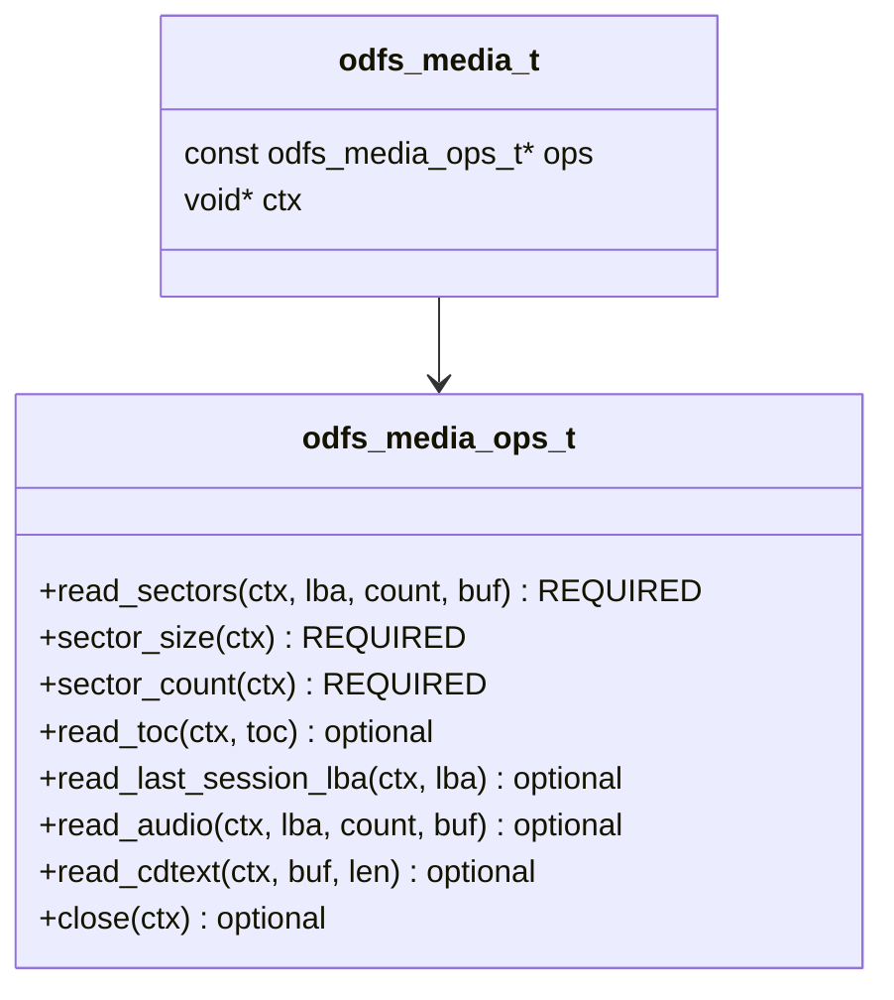
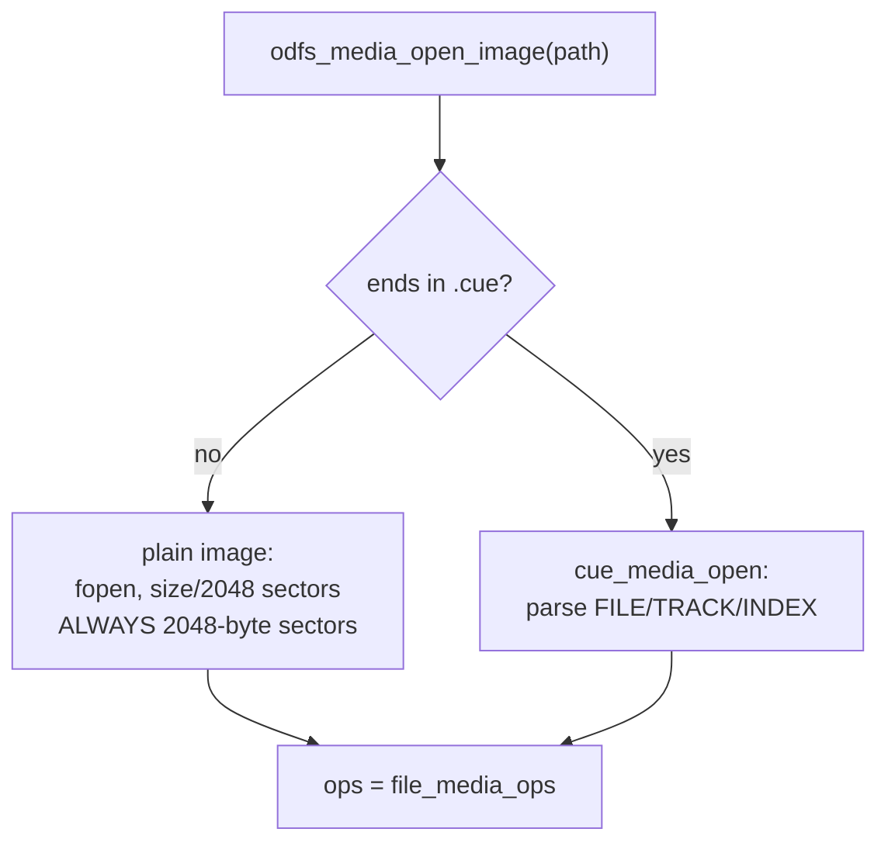
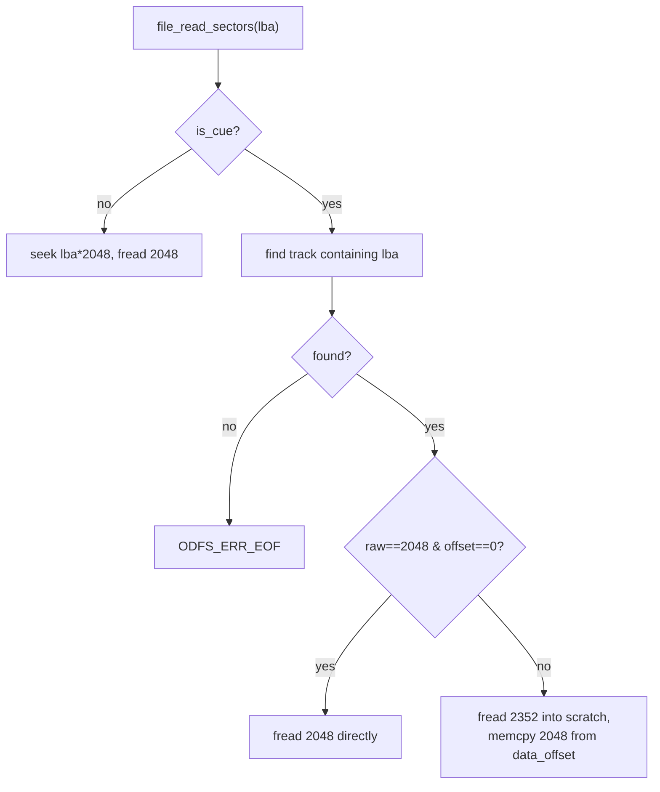
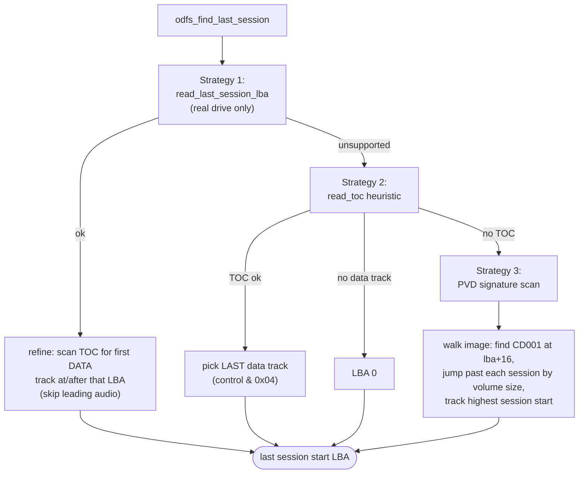
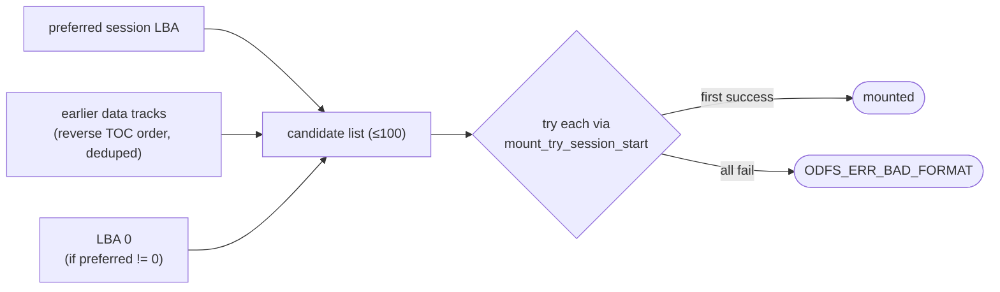

# Media Layer & Multisession

The media layer is the seam between "a filesystem parser" and "where the bytes
actually come from". It is one vtable, `odfs_media_t`, with two concrete
implementations: the host image/`.cue` backend (`platform/host/file_media.c`) and
the Amiga SCSI/trackdisk adapter (`platform/amiga/handler_main.c`). This document
covers the vtable, both implementations, the TOC model, and the multisession
discovery that decides *which* part of a disc to mount.

## The media vtable



`include/odfs/media.h:32`. Three ops are mandatory — sector reads and geometry.
The rest are *optical-only* and may be NULL. Callers never call through the
function pointers directly; they use the inline wrappers (`odfs_media_read_toc`,
`odfs_media_read_audio`, …) which turn a NULL op into `ODFS_ERR_UNSUPPORTED`
(`include/odfs/media.h:110`). This is the mechanism by which a host image
"gracefully lacks" a TOC and the CDDA backend simply never activates on a host.

```mermaid
flowchart LR
    Caller["odfs_media_read_audio(m, …)"] --> Check{m->ops->read_audio == NULL?}
    Check -->|yes| Uns[return ODFS_ERR_UNSUPPORTED]
    Check -->|no| Call[m->ops->read_audio(...)]
```

### The TOC model

`odfs_toc_t` (`include/odfs/media.h:23`) holds up to 99 entries. A naming caveat
worth flagging for anyone reading the struct: the array is called `sessions[]` but
each entry is really a **TOC track** — `number`, a SCSI `control` nibble (bit 2 set
⇒ data track), `start_lba`, and `length`. The `control & 0x04` test ("is this a
data track?") recurs across `mount.c`, `session.c`, and `cdda.c`; it is the single
most important bit in the whole TOC.

## Host implementation (`file_media.c`)

`odfs_media_open_image` (`platform/host/file_media.c:454`) dispatches on file
extension: `.cue` → the cue parser, everything else → a plain image.



### Plain images

A plain `.iso`/`.bin` is opened, sized, and divided into 2048-byte sectors.
`read_sectors` (`file_media.c:349`) seeks to `lba * 2048` and `fread`s
`count * 2048` bytes in one go; a short read at EOF yields `ODFS_ERR_EOF`.

> **Sharp edge: no sector-size autodetection.** `file_sector_size` always returns
> 2048 (`file_media.c:421`). A *raw* 2352-byte-per-sector image opened directly
> (not via `.cue`) is misinterpreted — wrong sector count, garbage data. Raw/cooked
> handling exists **only** through the `.cue` path. The `offset` is a `long`, which
> caps image size at ~2 GiB on ILP32 hosts.

### `.cue` images

The cue parser (`cue_media_open`, `file_media.c:183`) understands a single backing
FILE, `MODE1/2048` (cooked), `MODE1/2352` and `MODE2/2352` (raw, with the user-data
bytes at offset 16 or 24), and `INDEX 01` MSF timestamps. For raw sectors,
`read_sectors` reads the full 2352-byte sector and extracts the 2048 user-data
bytes (`file_media.c:372`).



> **Sharp edge: `.cue` track layout is *not* exposed as a TOC.** `read_toc` is NULL
> on the host (`file_media.c:447`), even when a `.cue` clearly describes tracks. The
> cue track table is used purely to resolve raw/cooked offsets for data reads.
> `AUDIO` tracks in a cue are rejected (`ODFS_ERR_UNSUPPORTED`). Consequently the
> **CDDA backend can never activate from a host image** — it requires a live
> `read_toc` + `read_audio`, which only the Amiga adapter provides. CDDA unit tests
> inject a fake media with those ops.

What the host stubs (all NULL): `read_toc`, `read_last_session_lba`, `read_audio`,
`read_cdtext`. Net effect on host: cooked 2048-byte data reads only — exactly the
surface the ISO/UDF/HFS parsers need, which is why those backends are fully
host-testable and CDDA is not.

## Amiga implementation (the SCSI/trackdisk adapter)

On the Amiga, `odfs_media_t` is backed by `amiga_media_ops` (`handler_main.c:841`),
whose `ctx` points at the handler's global state `g`. This adapter is where the
hardware reality lives: DMA alignment, SCSI passthrough vs. trackdisk fallback, and
the >4 GB `TD_READ64` path.

```mermaid
flowchart TD
    RS["amiga_read_sectors(lba, count)"] --> Chunk[chunk into DMA buffer<br/>≤ 8 sectors at a time]
    Chunk --> Off[byte offset = lba * sector_size]
    Off --> Big{high 32 bits nonzero?}
    Big -->|yes| R64[TD_READ64 (DVD > 4 GB)]
    Big -->|no| R32[CMD_READ]
    R64 --> Copy
    R32 --> Copy[memcpy DMA buffer → caller]
```

Key properties:

- **DMA bounce buffer.** All reads land in a 16-byte-aligned buffer allocated from
  `de_BufMemType` (often `MEMF_CHIP`) at startup, then `memcpy`'d to the caller
  (`handler_main.c:202`, `:3596`). This satisfies 68040 DMA alignment and chip-RAM
  controllers; the extra copy is negligible against CD seek latency.
- **SCSI capability tri-states.** `read_toc`, `read_last_session_lba`, `read_audio`,
  and `read_cdtext` are each gated by a tri-state flag in `g` (`-1` unknown / `0`
  unsupported / `1` ok). On the first "Illegal Request / Invalid Command" sense, the
  flag latches to 0 and the command is never re-issued — so an IDE drive behind
  `trackdisk`-style access silently falls back to TOC heuristics and disables CDDA
  instead of erroring repeatedly. This is the classic CDVDFS degradation pattern.
- **`sector_count` returns 0.** CD media size isn't reliably reported, so the core
  must not assume a fixed sector count (`handler_main.c:273`); the PVD-scan
  multisession strategy is skipped on real hardware in favour of TOC queries.

The full SCSI/device lifecycle (OpenDevice, MODE SELECT to force 2048-byte blocks,
TEST UNIT READY, media-change interrupt) is covered in
[amiga-handler.md](amiga-handler.md#device-and-media-prep).

## Multisession discovery

A multisession disc has had data appended in separate burns. Only the *last* data
session reflects the disc's current state — earlier sessions may reference files
that the last session has logically replaced. ODFS therefore defaults to mounting
the last session, and `core/session.c` is how it finds it.



1. **Explicit query (`core/session.c:52`).** Real Amiga drives answer "where does
   the last session start?" via the MMC multisession command. Because that session
   can begin with *audio* tracks on a mixed disc, the code refines the answer to the
   first **data** track at or after the reported LBA — that's where a filesystem
   would actually be (`core/session.c:65`).
2. **TOC heuristic (`core/session.c:99`).** No explicit query? Read the TOC and pick
   the last entry with the data-track control bit set. If there's no data track at
   all (pure audio CD), return LBA 0 and let the CDDA path take over.
3. **PVD scan (`core/session.c:129`).** Host images have no TOC. Scan every candidate
   PVD location (`session_start + 16`), look for `CD001` with descriptor type 1, and
   jump forward past each session using its declared `volume_space_size`. The highest
   session start wins (`core/session.c:143`). On unknown size, return LBA 0.

### The candidate list and retry loop

`odfs_find_last_session` gives a *preferred* start, but mastering quirks mean the
preferred LBA isn't always mountable. So `odfs_mount` doesn't trust a single
answer — it builds a **candidate list** and tries each in turn:



`mount_build_session_candidates` (`core/mount.c:55`) assembles the list:
preferred first, then every data track from the TOC walked newest-first (skipping
duplicates and non-data tracks), then LBA 0 as the final fallback. The mount loop
(`core/mount.c:382`) tries each until one yields a recognised format. Because the
block cache is keyed by absolute LBA, retrying a different session start is
automatically cache-correct — no flush needed between attempts.

### The relative-vs-absolute LBA trap

There is a second, subtler multisession problem that lives *inside* the ISO and
Joliet backends, not here: mastering tools disagree on whether on-disc root
directory LBAs are session-relative or absolute. The ISO mount applies a heuristic
(if the root LBA is below `session_start`, treat it as relative and add the offset;
then, if it turns out absolute, zero the stored session offset to avoid
double-counting). This is documented in
[backends-iso-family.md](backends-iso-family.md#the-multisession-lba-heuristic),
because it's a property of the *parsers*, not the media layer.

## Limitations & gotchas (media layer)

| Area | Limitation | Where |
| --- | --- | --- |
| Host plain images | No 2352-byte autodetect; assumes 2048 | `file_media.c:421` |
| Host `.cue` | Single backing FILE only; no `.toc` parser | `file_media.c:218` |
| Host TOC | `read_toc` is NULL even for `.cue` ⇒ no host CDDA | `file_media.c:447` |
| Host offsets | `long` file offset caps ~2 GiB on ILP32 | `file_media.c:353` |
| Amiga geometry | `sector_count` returns 0 (size unknown) | `handler_main.c:273` |
| Cache | One sector per miss; backends loop for runs | `core/cache_block.c:120` |
