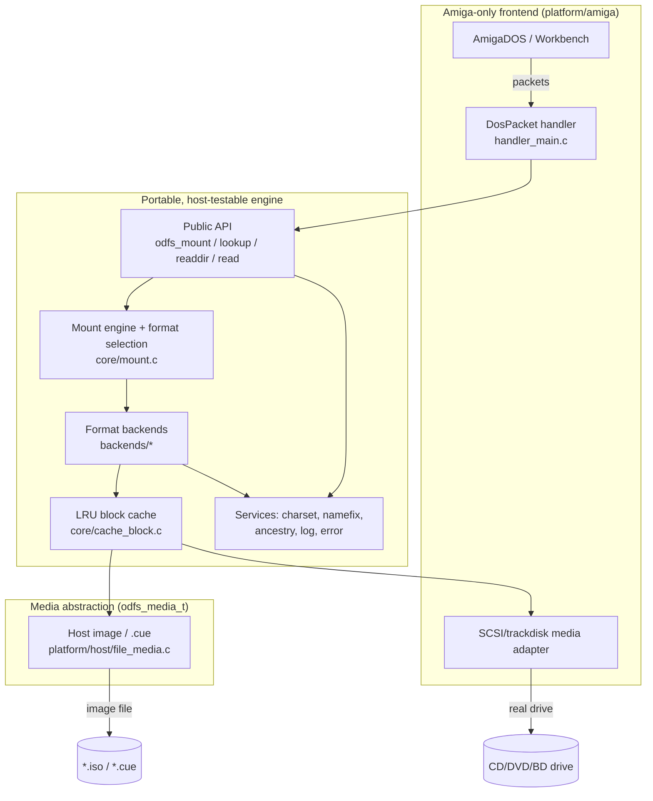
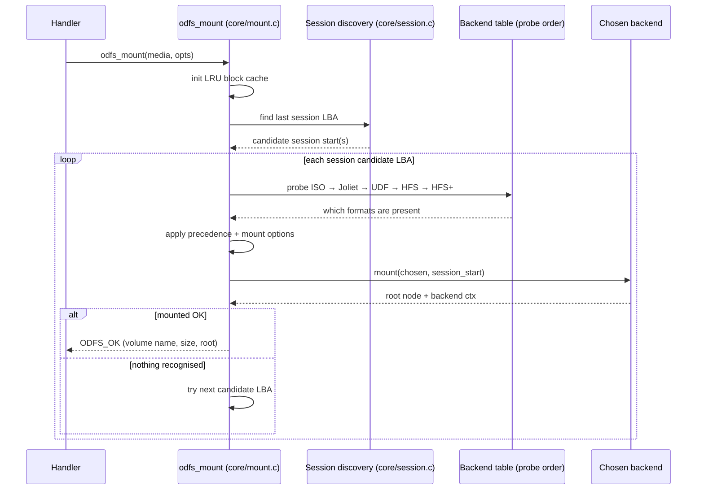

# ODFileSystem — Overview

## The problem

The Amiga shipped into a world of floppy disks and quickly grew CD-ROM drives,
but its operating system never gained a single, modern, complete optical-disc
filesystem. Real-world discs are *messy*: a CD-ROM might carry plain ISO 9660 for
DOS compatibility, Rock Ridge for Unix, and Joliet for Windows — all describing
the *same* files three different ways. A "bridge" disc carries ISO **and** UDF. A
Mac hybrid carries ISO **and** HFS. A game disc mixes a data track with Red Book
audio tracks. A multisession disc has had data appended over months, and only the
*last* session is current.

ODFileSystem's job is to make all of that look like one boring, read-only
AmigaDOS volume that you can `Lock`, `Examine`, and `Read` like any floppy — and
to do it in a handler small enough to live in ~60 KB (or ~32 KB for the ROM
profile), on a 68000, with no `ixemul`, no libc to speak of, and a hostile DMA
story.

## The shape of the solution

The system is split into a thin, Amiga-specific **frontend** and a thick,
portable **core + backends**. The dividing line is deliberate and load-bearing:
everything below the handler is plain C11 that compiles and runs on your
development machine, so the parsers, the cache, the charset code, and the mount
logic can all be unit-tested, fuzzed, and golden-tested against image files with
no emulator in the loop.

The handler talks *only* to the public API in `include/odfs/api.h`. It never
reaches into a backend. The backends never know whether they are feeding an
AmigaDOS `FileInfoBlock` or a host `imgls` command. The cache never knows whether
its sectors come from a SCSI drive or a file on disk. Each seam is a vtable, and
each vtable is the reason the layer above it is testable in isolation.

## The five layers

| Layer | Lives in | Responsibility | Key abstraction |
| --- | --- | --- | --- |
| **A. AmigaDOS frontend** | `platform/amiga/` | Packet protocol, locks, file handles, Workbench volume, DMA bounce buffer | `DosPacket` ↔ core calls |
| **B. Core engine** | `core/` | Mount + format selection, the node model, path resolution, cache coordination | `odfs_mount_t`, `odfs_node_t` |
| **C. Media access** | `include/odfs/media.h`, `platform/host`, the Amiga adapter | Sector reads, geometry, TOC/session discovery | `odfs_media_t` vtable |
| **D. Format backends** | `backends/` | Parse one on-disc format into nodes | `odfs_backend_ops_t` vtable |
| **E. Auxiliary services** | `core/` | Logging, charset, name dedup, ancestry, errors, allocation | small standalone modules |

These map one-to-one onto the documents in this directory; see
[architecture.md](architecture.md) for the layer-by-layer detail.

## The central data structure: `odfs_node_t`

Everything the user can touch — a file, a directory, a symlink, a virtual audio
track — is an `odfs_node_t` (`include/odfs/node.h:65`). It is a flat, copyable,
self-describing value: a name (UTF-8), a kind, a size, timestamps, an on-disc
`extent` (LBA + length), optional Amiga protection/comment metadata, and a tag
saying which backend produced it.

The crucial design decision: **nodes are passed by value and carry no live
pointers into backend state.** A backend reconstructs everything it needs from the
node's `extent` and `backend` tag on each call. This is why a `Lock` can outlive
the directory scan that produced it, why `odfs_node_matches_identity()` compares
*content* (backend + kind + size + extent + name) rather than a pointer or an id,
and why the transient `id`/`parent_id` fields — regenerated on every directory
walk — are explicitly *not* used for identity. See
[core-layer.md](core-layer.md#the-node-model) for the full contract.

## The central operation: mount

Mounting is where all the interesting policy lives — multisession discovery, the
hybrid/bridge precedence rules, and the multi-LBA retry loop.

The precedence rules ("Rock Ridge beats Joliet beats plain ISO; ISO-family beats
UDF and HFS unless forced") are the heart of the user-visible behaviour and are
specified in [architecture.md](architecture.md#format-selection) and implemented
in `core/mount.c:101` (`mount_try_session_start`). The session candidate logic —
"prefer the last data session, but be ready to fall back to earlier sessions and
to LBA 0" — is in `core/mount.c:55` and `core/session.c`, and is documented in
[media-layer.md](media-layer.md#multisession-discovery).

## The cast of characters

- **`odfs_mount_t`** — one mounted volume. Owns the media handle, the cache, the
  active backend plus a per-backend dispatch map (so a mixed-mode disc can route
  `CDDA/` to the audio backend and everything else to ISO). `include/odfs/api.h:32`.
- **`odfs_backend_ops_t`** — the eight-function contract every format reader
  implements: `probe`, `mount`, `unmount`, `readdir`, `read`, `lookup`,
  `get_volume_name`, `get_volume_size`. `include/odfs/backend.h:22`.
- **`odfs_media_t`** — the device/image vtable: `read_sectors`, `sector_size`,
  `read_toc`, `read_audio`, `read_cdtext`, … `include/odfs/media.h:86`.
- **`odfs_cache_t`** — a fixed-capacity LRU cache of 2048-byte sectors, the single
  choke point through which all parser I/O flows. `include/odfs/cache.h:34`.
- **The handler's `handler_global_t g`** — the per-process state block on the
  Amiga side: lock list, file-handle list, device I/O request, DMA buffer, volume
  node. There are no other mutable globals, which is what makes multiple mounts
  (`CD0:`, `CD1:`) independent. See [amiga-handler.md](amiga-handler.md).

## Why it is read-only

Optical media is, for the workloads ODFS targets, read-only — and a read-only
handler is dramatically simpler and safer: no write-back cache coherence, no
allocation, no journaling, no partial-write recovery. Every write packet
(`ACTION_WRITE`, `ACTION_DELETE_OBJECT`, `ACTION_SET_PROTECT`, …) is answered with
`ERROR_DISK_WRITE_PROTECTED` (`handler_main.c:2696`). This is a feature, not a
gap.

## Where to go next

- To understand the **structure**, read [architecture.md](architecture.md).
- To follow a **request through every layer**, read [data-flows.md](data-flows.md).
- To work on a **specific subsystem**, jump to its document from the table in
  [README.md](README.md).
