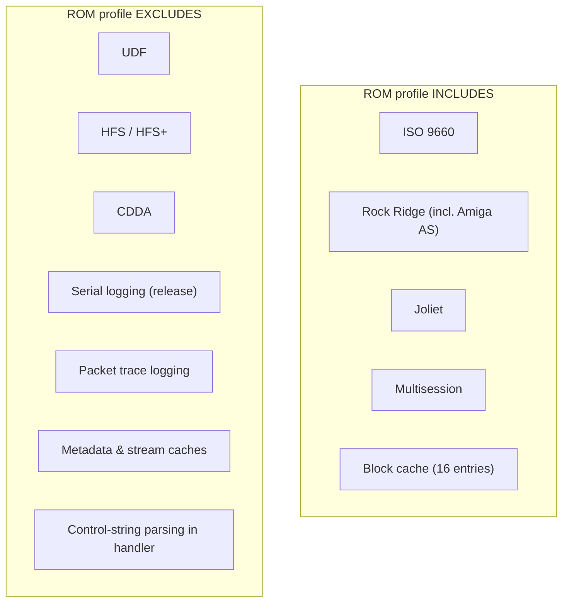

# ROM Profile

The ROM profile is a deliberately minimal build of ODFS, small enough to be a
candidate for ROM/Kickstart-style deployment where every byte and every runtime
allocation is scrutinised. It is the same source tree as the full build, selected
by `-DODFS_PROFILE_ROM` and a handful of feature flags. For the full build/flag
mechanics see [build-system.md](build-system.md); this page is the ROM-specific
contract.

## Goals

- Small footprint (a hard 32 KB budget).
- Minimal external dependencies.
- Deterministic init.
- Quiet release build by default (no serial output).
- No heavy runtime allocation assumptions (block cache only, 16 entries).

## What's in vs. out



These exclusions are pure subtractions enabled by the architecture: backends are
gated by `#if ODFS_FEATURE_*` and registered through a table
([architecture.md](architecture.md#format-selection)), so dropping UDF/HFS/CDDA
removes them with no call-site churn. The handler additionally `#if`-compiles out
the `Control=` string parser under ROM, dropping the `dos/rdargs.h` dependency — a
ROM mount uses only `odfs_mount_opts_default`
([amiga-handler.md](amiga-handler.md#rom-vs-full-handler)).

## Config differences at a glance

| Aspect | Full (`ODFS_PROFILE_FULL`) | ROM (`ODFS_PROFILE_ROM`) |
| --- | --- | --- |
| Backends | ISO, RR, Joliet, UDF, HFS, HFS+, CDDA | ISO, RR, Joliet only |
| Multisession | yes | yes |
| Block cache size | 128 entries | 16 entries |
| Metadata / stream cache | enabled | disabled |
| Log level ceiling | `TRACE` | `WARN` |
| Serial logging (release) | off | off |
| Handler control-string parsing | yes | compiled out |
| Size budget | 60000 bytes | 32768 bytes |

All values come from `include/odfs/config.h`.

## Build

```sh
make rom        # release ROM handler → build/amiga-rom/, serial OFF
make rom-test   # debug ROM handler → build/amiga-rom-test/, serial ON
```

These targets do not reuse or clobber the normal Amiga build in `build/amiga/`.
`make rom` writes the release ROM-profile handler with serial output disabled;
`make rom-test` enables serial output and disables the size cap for debugging.

## Size budget

```sh
make rom                       # enforces ROM_SIZE_LIMIT = 32768
make rom ROM_SIZE_LIMIT=<bytes>  # raise the ceiling intentionally
```

`make rom` fails the build if the handler exceeds 32 KB (recently raised from a
tighter limit, commit `59bf94f`). The normal release handler similarly enforces
`AMIGA_SIZE_LIMIT = 60000`. The size check is the forcing function behind the ROM
feature subset, `-Os`, and the freestanding runtime
([amiga-handler.md](amiga-handler.md#freestanding-runtime)). Override the ceiling
only for a deliberate, reviewed growth.

## Why these exclusions, specifically

- **UDF / HFS / HFS+** are the largest parsers and the least essential for the
  Amiga's historical media (CD-ROM, CD32, CDTV), which are overwhelmingly ISO-family.
- **CDDA** depends on SCSI audio passthrough and pulls in WAV/AIFF synthesis and CD-
  Text parsing — a lot of code for a feature a ROM filesystem doesn't need.
- **Metadata/stream caches and serial logging** are pure runtime conveniences with a
  code-size cost.

What remains — ISO 9660 with Rock Ridge (including the Amiga `AS` extension) and
Joliet, with multisession — is the set that actually matters for booting and
browsing the discs the Amiga ecosystem produced.
