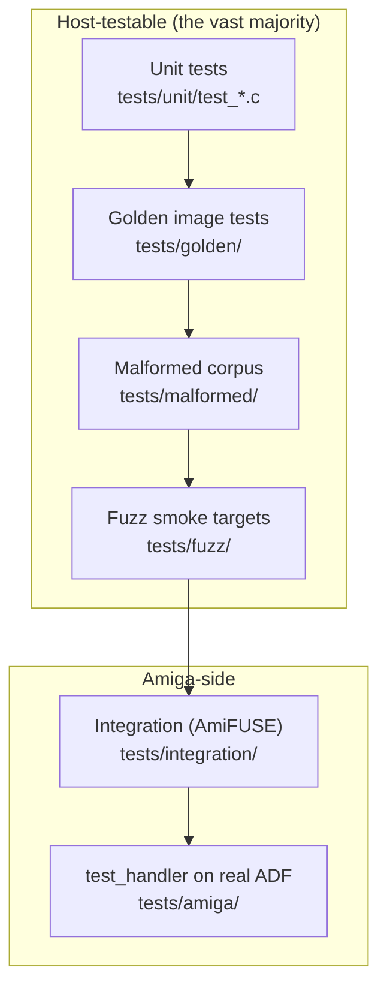
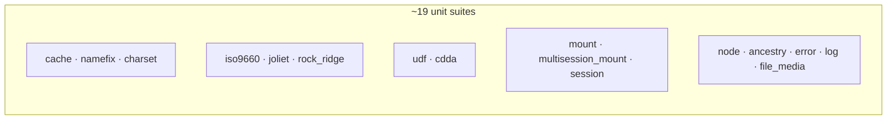
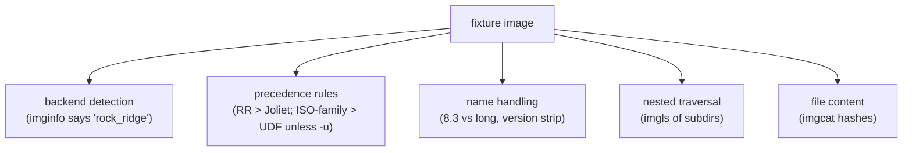
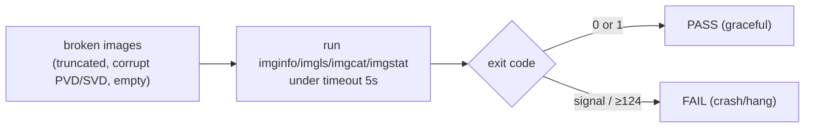
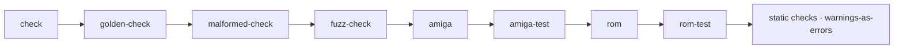

# Testing Strategy

ODFS is a filesystem driver for hardware most contributors don't have, parsing
formats with decades of real-world variation and malformation. The testing strategy
is built around one principle that makes that tractable: **most logic must be
testable on a host machine.** Because the core and backends sit above the
`odfs_media_t` seam ([media-layer.md](media-layer.md)), an image file on a laptop
stands in for an optical drive, and the overwhelming majority of the filesystem can
be exercised with no Amiga in the loop.

## Principles

- Most logic must be testable on host systems.
- Every parser/backend must have direct tests.
- Every bug fixed becomes a regression test.
- Every supported format has golden images.
- Robustness (no crash, no hang) is tested separately from correctness.

## The test pyramid



## Unit tests (`tests/unit/`)

A ~100-line header-only harness (`tests/unit/test_harness.h`): `TEST(name){…}`
registers a function via a constructor, `TEST_MAIN()` runs them all and returns
non-zero on any failure. Assertions include the domain helpers `ASSERT_OK(err)` and
`ASSERT_ERR(err, code)`. One `test_*.c` file per concern, auto-discovered by the
Makefile.



Representative patterns:

- **`test_cache.c`** installs a mock `odfs_media_ops_t` (each sector filled with its
  LBA byte, reads counted) and asserts hit/miss/eviction/flush behaviour and LRU
  ordering with a 2-slot cache — the cache is validated with zero real I/O.
- **`test_mount.c`** registers two fake backends (a main one and a virtual CDDA one)
  via `odfs_mount_register_backend` and verifies that `odfs_resolve_path` routes
  `CDDA/Track01.wav` to the CDDA backend while other paths route to the main one —
  i.e. the dispatch map ([architecture.md](architecture.md#dispatch-after-mount-the-backend-map))
  is correct.
- **`test_charset.c`** drives UCS-2/Mac Roman/ISO conversion and sanitisation,
  including odd-length rejection and CJK code points.
- **`test_namefix.c`** asserts deterministic `~2`/`~3` suffixing and
  case-insensitive collision detection.
- **`test_iso9660.c`** is white-box: it checks on-disc offset constants against the
  ECMA-119 spec so a careless edit to the offset `#define`s is caught immediately.

Run them all:

```sh
make check
```

## Golden image tests (`tests/golden/`)

`test_formats.sh` drives the real `imginfo`/`imgls`/`imgcat` binaries against
checked-in fixtures in `tests/images/` (plain ISO, RR, Joliet, RR+Joliet,
multisession, UDF-only, UDF-bridge, HFS, HFS+). It asserts the *user-visible
contract*:



For each image it pins the detected backend, volume name, directory listings, and
file content, so a regression in format selection or a parser shows up as a concrete
diff. If fixtures are absent, the suite skips cleanly.

### The real-world Amiga `AS` fixture

The crown jewel of the golden suite is a test against a *genuine* Amiga CD32 disc.
`fetch_real_as_fixture.sh` downloads the small **Arabian Nights (1993)** archive
from Archive.org on demand, verifies its MD5, extracts the data track to a plain
2048-byte ISO, and caches it; `test_as_real.sh` then asserts the backend is
`rock_ridge`, the volume is `Arabian_Nights`, and the Amiga `AS` protection bytes
are exactly `00 00 ff 10` at the root and at `/c`. This validates the Rock Ridge
Amiga `AS` parsing ([backends-iso-family.md](backends-iso-family.md#the-amiga-as-extension))
against real burned-on-disc metadata, not a synthetic fixture.

The test **skips cleanly** (exit 2) if `curl`/`7z`/`python3`/network are
unavailable, and honours `ODFS_REAL_AS_IMAGE=/path` to reuse a local image without
downloading.

```sh
make golden-check
```

## Malformed image tests (`tests/malformed/`)

This suite is about *robustness, not correctness*. A static corpus
(`not-an-image.bin`, `pvd-like-garbage.bin`, `short-sector.bin`) plus runtime-
generated truncations and corrupted signatures are fed to every tool under a 5-second
`timeout`. The only pass condition: **the tool must not crash or hang** — exit codes
0 or 1 are fine; a signal or timeout (≥124) fails.



This is the suite that proves the bounds checks documented in the backend pages
(record length guards, CE recursion caps, SL payload limits) actually hold against
adversarial input.

```sh
make malformed-check
```

## Fuzz targets (`tests/fuzz/`)

Six smoke targets (`fuzz_auto`, `fuzz_iso9660`, `fuzz_joliet`, `fuzz_udf`,
`fuzz_hfs`, `fuzz_hfsplus`), each delegating to a shared harness that forces a
backend and then exercises the full read path defensively: mount, `readdir` of root,
`lookup`/`resolve_path` on the first entry, `read` of the first file, one level of
subdir recursion — ignoring all error returns, catching only crashes.
`run_fuzz.sh` runs every target against every image in `tests/images` plus the
malformed corpus, each under `timeout 5`.

```sh
make fuzz-check
```

## Integration tests (`tests/integration/`)

`test_amifuse.sh` is the closest a host can get to the real thing: it loads the
*actual m68k handler binary* via **AmiFUSE** and FUSE-mounts an image on the host,
then verifies file content and runs two Python probes — `check_assign_prefix.py`
(DOS ASSIGN-prefix path handling) and `check_fh_packets.py` (file-handle packet
behaviour). It auto-generates a temp ISO if none is supplied and skips cleanly if
AmiFUSE or its tooling is missing.

```sh
make integration-check
AMIGAOS32_ISO=/path/to/AmigaOS3.2CD.iso make integration-check
```

The `tests/amiga/test_handler.c` tool is packed into the test ADF (`make adf`) for
exercising lock/file-handle parent semantics on a *real* Amiga or emulator:

```sh
test_handler CD0:some/deep/directory REL=///sibling
test_handler CD0:CDDA/Track01.wav FILE=CD0:CDDA/Track01.wav
```

## Differential testing

Behaviour is compared against reference implementations (NetBSD, OpenBSD, Linux,
CDVDFS). Each difference is triaged as a bug, an intentional policy difference (e.g.
the ISO-family-over-UDF default,
[architecture.md](architecture.md#format-selection)), or an unsupported legacy
quirk.

## CI requirements

Every push runs the full gate in the `stefanreinauer/amiga-gcc` container:



Build, unit tests, golden image tests, malformed-image tests, parser fuzz smoke
tests, all four handler builds, static analysis (Coverity on push to main), and
warnings-as-errors — per push. See [build-system.md](build-system.md#ci).

## How to add a test for a new bug

The project's rule is "every bug fixed becomes a regression test." In practice:

1. If it's a parser/logic bug, add or extend a `tests/unit/test_*.c` suite, or check
   in a minimal fixture image under `tests/images/` and pin behaviour in
   `test_formats.sh`.
2. If it's a *crash* on bad input, add the offending image to the malformed corpus —
   the robustness suite will then guard it forever.
3. If it's handler/packet behaviour, extend the integration probes.
